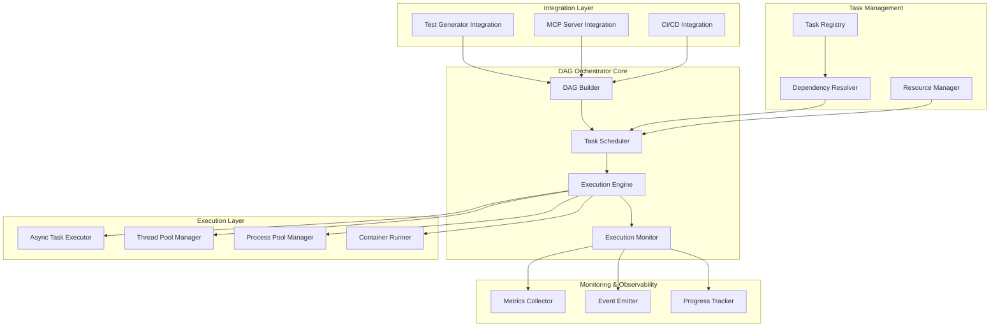
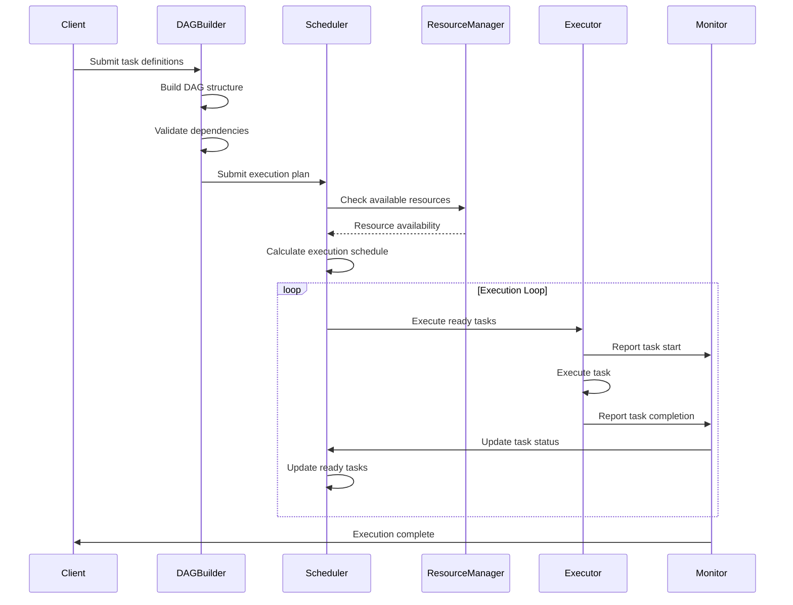

# Design Document

## Overview

The DAG Orchestrated Parallel Execution system provides intelligent task scheduling and dependency management for parallel workloads. Built on a directed acyclic graph (DAG) foundation, it optimizes resource utilization, handles complex dependencies, and provides comprehensive monitoring capabilities. The system is designed to enhance the existing parallel test generator while being extensible to other parallel execution scenarios.

## Architecture

**Governance Foundation**: This architecture implements physics-informed design principles with mathematical DAG validation as the non-negotiable constraint. All components follow the coordinator-worker pattern and inherit from ReflectiveModule for systematic observability.

### Core Components



### DAG Execution Flow



## Existing Infrastructure Integration

### DAG Registry Integration (ADR-006 Compliance)

**Rationale**: Use existing `src/rm_ddd/core/dag_registry.py` instead of external graph libraries for mathematical validation.

```python
from src.rm_ddd.core.dag_registry import DAGRegistry
from src.rm_ddd.core.unified_reflective_module import ReflectiveModule

class DAGOrchestrator(ReflectiveModule):
    """DAG orchestration using existing mathematical validation infrastructure."""
    
    def __init__(self):
        super().__init__()  # Beastly Module powers
        self.dag_registry = DAGRegistry()
    
    def validate_execution_plan(self, tasks: List[TaskDefinition]) -> bool:
        """Use existing DAG registry for mathematical validation."""
        # Leverage existing cycle detection: _would_create_cycle()
        # Use existing topological sort: get_dependency_chain()
        # Apply existing DAG validation: validate_dag()
        return self.dag_registry.validate_dag_consistency(tasks)
```

### ReflectiveModule Integration (Proven Beastly Module Pattern)

**Rationale**: Steal and adapt the comprehensive ReflectiveModule from hackathon directory - it's battle-tested with extensive capabilities.

**Key Capabilities from Hackathon Implementation:**
- **Automatic Observability**: Prometheus metrics, health endpoints, structured logging
- **Operation Tracing**: Complete audit trails with correlation IDs and performance metrics
- **CLI Generation**: Dynamic CLI interface generation through method introspection
- **CMS Integration**: Configuration and content storage through Directus
- **Observatory Integration**: Real-time event emission for monitoring dashboards
- **Resource Tracking**: Memory usage, CPU time, and performance analytics
- **Graceful Degradation**: Systematic failure handling with capability management

```python
# ✅ STEAL this proven implementation:
from src.rm_ddd.core.unified_reflective_module import ReflectiveModule

class DAGOrchestrator(ReflectiveModule):
    """DAG orchestrator with comprehensive beastly powers."""
    
    def __init__(self):
        super().__init__()
        # Automatically provides ALL of this without additional code:
        # - Prometheus metrics registration and collection
        # - Health endpoints (/health, /ready, /metrics) 
        # - Structured logging with correlation IDs
        # - Performance tracing with memory and timing metrics
        # - CLI interface generation through introspection
        # - CMS integration for configuration storage
        # - Observatory real-time event broadcasting
        # - Operation audit trails with complete traceability
        # - Resource usage tracking and optimization
        # - Graceful degradation and error handling
    
    def orchestrate_dag(self, tasks: List[TaskDefinition]) -> ExecutionResult:
        """Orchestrate DAG execution with automatic tracing."""
        with self.trace_operation("orchestrate_dag", tasks=len(tasks)) as trace:
            # Emit real-time observation
            self.emit_observation(
                f"Starting DAG orchestration with {len(tasks)} tasks",
                event_type="deployment",
                emoji="🚀"
            )
            
            # Your orchestration logic here
            result = self._execute_dag_logic(tasks)
            
            # Trace captures everything automatically
            trace.output_result = result
            return result
```

**Why This is Superior:**
- **Proven in Production**: Already battle-tested in hackathon environment
- **Zero Infrastructure**: No additional monitoring setup required
- **Complete Observability**: Everything you need for debugging and operations
- **Automatic CLI**: Method introspection generates CLI interfaces
- **Observatory Integration**: Real-time monitoring dashboard integration

## Components and Interfaces

### DAG Builder (Coordinator Component)

**Purpose:** Pure orchestrator that constructs and validates DAG structures without direct execution.

**Governance Compliance:**
- Inherits from ReflectiveModule (Beastly Module pattern)
- Implements coordinator-worker architecture (never executes tasks directly)
- Enforces mathematical DAG validation as non-negotiable constraint

**Key Methods:**
- `build_dag(tasks: List[TaskDefinition]) -> DAG`
- `validate_dag_mathematical_consistency(dag: DAG) -> ValidationResult`
- `detect_cycles_with_decomposition_guidance(dag: DAG) -> CycleAnalysis`
- `analyze_critical_path(dag: DAG) -> List[TaskNode]`

**Responsibilities:**
- Parse task definitions and dependencies using mathematical validation
- Detect circular dependencies with O(V+E) cycle detection algorithm
- Provide decomposition guidance when cycles are detected
- Calculate critical path using longest path algorithms
- Maintain mathematical invariants throughout DAG construction

### Task Scheduler

**Purpose:** Intelligently schedules tasks based on dependencies, resources, and optimization policies.

**Key Methods:**
- `schedule_execution(dag: DAG, config: SchedulingConfig) -> ExecutionPlan`
- `get_ready_tasks(dag: DAG) -> List[TaskNode]`
- `update_task_status(task_id: str, status: TaskStatus) -> None`
- `rebalance_execution(current_state: ExecutionState) -> List[SchedulingAction]`

**Responsibilities:**
- Determine task execution order
- Manage resource allocation
- Handle dynamic rescheduling
- Optimize for throughput and latency

### Execution Engine

**Purpose:** Coordinates actual task execution across different execution backends.

**Key Methods:**
- `execute_task(task: TaskNode, context: ExecutionContext) -> TaskResult`
- `execute_batch(tasks: List[TaskNode]) -> List[TaskResult]`
- `cancel_task(task_id: str) -> bool`
- `get_execution_status() -> ExecutionStatus`

**Responsibilities:**
- Route tasks to appropriate executors
- Manage execution lifecycle
- Handle cancellation and cleanup
- Coordinate with monitoring systems

### Resource Manager

**Purpose:** Monitors and manages system resources for optimal task allocation.

**Key Methods:**
- `get_available_resources() -> ResourceSnapshot`
- `reserve_resources(requirements: ResourceRequirements) -> ResourceReservation`
- `release_resources(reservation: ResourceReservation) -> None`
- `predict_resource_usage(tasks: List[TaskNode]) -> ResourcePrediction`

**Responsibilities:**
- Track CPU, memory, and I/O usage
- Enforce resource limits
- Predict resource requirements
- Optimize resource allocation

### Task Executors

#### Async Task Executor
**Purpose:** Execute async tasks using asyncio event loop.

```python
class AsyncTaskExecutor:
    async def execute(self, task: AsyncTask, context: ExecutionContext) -> TaskResult
    async def execute_batch(self, tasks: List[AsyncTask]) -> List[TaskResult]
    def get_concurrency_limit(self) -> int
    def set_concurrency_limit(self, limit: int) -> None
```

#### Thread Pool Executor
**Purpose:** Execute CPU-bound tasks using thread pools.

```python
class ThreadPoolExecutor:
    def execute(self, task: SyncTask, context: ExecutionContext) -> TaskResult
    def execute_batch(self, tasks: List[SyncTask]) -> List[TaskResult]
    def resize_pool(self, size: int) -> None
    def get_pool_stats() -> PoolStats
```

#### Process Pool Executor
**Purpose:** Execute isolated tasks using separate processes.

```python
class ProcessPoolExecutor:
    def execute(self, task: IsolatedTask, context: ExecutionContext) -> TaskResult
    def execute_batch(self, tasks: List[IsolatedTask]) -> List[TaskResult]
    def manage_worker_lifecycle() -> None
    def get_worker_health() -> List[WorkerStatus]
```

## Data Models

### Core DAG Structures

```python
@dataclass
class TaskNode:
    id: str
    name: str
    task_type: str
    dependencies: List[str]
    resource_requirements: ResourceRequirements
    estimated_duration: float
    retry_policy: RetryPolicy
    timeout: float
    metadata: Dict[str, Any]

@dataclass
class DAG:
    nodes: Dict[str, TaskNode]
    edges: List[Tuple[str, str]]
    metadata: Dict[str, Any]
    
    def get_ready_tasks(self, completed: Set[str]) -> List[TaskNode]
    def get_critical_path(self) -> List[TaskNode]
    def validate(self) -> ValidationResult

@dataclass
class ExecutionPlan:
    dag: DAG
    scheduling_strategy: SchedulingStrategy
    resource_allocation: ResourceAllocation
    execution_phases: List[ExecutionPhase]
    estimated_completion: datetime
```

### Resource Management

```python
@dataclass
class ResourceRequirements:
    cpu_cores: float
    memory_mb: int
    disk_io_mb_per_sec: Optional[int]
    network_mb_per_sec: Optional[int]
    gpu_count: Optional[int]
    custom_resources: Dict[str, Any]

@dataclass
class ResourceSnapshot:
    available_cpu: float
    available_memory: int
    cpu_usage_percent: float
    memory_usage_percent: float
    active_tasks: int
    timestamp: datetime

@dataclass
class ResourceReservation:
    reservation_id: str
    resources: ResourceRequirements
    task_id: str
    expires_at: datetime
```

### Execution Tracking

```python
@dataclass
class TaskResult:
    task_id: str
    status: TaskStatus
    start_time: datetime
    end_time: Optional[datetime]
    duration: Optional[float]
    output: Optional[str]
    error_message: Optional[str]
    resource_usage: Optional[ResourceUsage]
    retry_count: int

@dataclass
class ExecutionStatus:
    total_tasks: int
    completed_tasks: int
    failed_tasks: int
    running_tasks: int
    pending_tasks: int
    completion_percentage: float
    estimated_remaining: float
    critical_path_progress: float
```

## Error Handling

### Failure Strategies

1. **Fail Fast**: Stop execution on first failure
2. **Continue on Error**: Execute independent branches despite failures
3. **Retry with Backoff**: Retry failed tasks with exponential backoff
4. **Circuit Breaker**: Prevent cascading failures in dependent systems

### Recovery Mechanisms

```python
@dataclass
class RetryPolicy:
    max_attempts: int
    backoff_strategy: BackoffStrategy
    retry_on_exceptions: List[Type[Exception]]
    timeout_multiplier: float

class FailureHandler:
    def handle_task_failure(self, task: TaskNode, error: Exception) -> FailureAction
    def handle_dependency_failure(self, task: TaskNode, failed_dependency: str) -> FailureAction
    def handle_resource_exhaustion(self, task: TaskNode) -> FailureAction
```

## Testing Strategy

### Unit Testing
- DAG construction and validation logic
- Scheduling algorithms and resource management
- Individual executor implementations
- Error handling and recovery mechanisms

### Integration Testing
- End-to-end DAG execution scenarios
- Resource manager integration with executors
- Monitoring and observability features
- Integration with existing test generation system

### Performance Testing
- Scalability with large DAGs (1000+ tasks)
- Resource utilization efficiency
- Scheduling overhead and latency
- Concurrent execution performance

### Chaos Testing
- Task failure scenarios and recovery
- Resource exhaustion handling
- Network partition and timeout scenarios
- Executor crash and restart behavior

## Integration Points

### Test Generation System Integration

The DAG orchestrator will enhance the existing parallel test generator by:

1. **Dependency Analysis**: Analyze test dependencies (setup/teardown, shared fixtures)
2. **Intelligent Scheduling**: Optimize test execution order for maximum parallelism
3. **Resource Optimization**: Prevent resource conflicts between concurrent tests
4. **Failure Isolation**: Isolate test failures to prevent cascading issues

### MCP Server Integration

New MCP tools will be added:
- `create_dag_execution_plan`: Create DAG from task definitions
- `execute_dag_async`: Execute DAG with real-time monitoring
- `analyze_dag_performance`: Analyze execution performance and bottlenecks
- `optimize_dag_structure`: Suggest DAG optimizations

### CI/CD Integration

The system will integrate with CI/CD pipelines by:
- Generating execution plans for complex build/test/deploy workflows
- Providing detailed execution reports and metrics
- Supporting conditional execution based on previous results
- Enabling parallel execution of independent pipeline stages

## Performance Considerations

### Scalability Targets
- Support DAGs with up to 10,000 tasks
- Handle concurrent execution of 100+ tasks
- Maintain sub-second scheduling latency
- Scale to multi-node distributed execution

### Optimization Strategies
- Lazy DAG evaluation for large graphs
- Incremental scheduling updates
- Resource prediction and pre-allocation
- Adaptive concurrency based on system performance

### Memory Management
- Streaming execution for large DAGs
- Garbage collection of completed task data
- Efficient graph representation and traversal
- Resource pooling and reuse
## En
vironment-Aware Service Layering Architecture

### Service Abstraction Layer Design

**Rationale**: Proper layering enables pointing to different shared service instances across development, staging, and production environments while maintaining code consistency.

```python
# Service Registry Pattern for Environment Flexibility
class ServiceRegistry:
    """Environment-aware service discovery and binding."""
    
    def __init__(self, environment: str = None):
        self.environment = environment or os.getenv("DEPLOYMENT_ENV", "development")
        self.service_configs = self._load_environment_config()
    
    def get_cms_client(self) -> DirectusClient:
        """Get CMS client for current environment."""
        config = self.service_configs["cms"][self.environment]
        return DirectusClient(
            base_url=config["url"],
            token=config["token"],
            timeout=config.get("timeout", 30)
        )
    
    def get_prometheus_exporter(self) -> PrometheusExporter:
        """Get Prometheus exporter for current environment."""
        config = self.service_configs["prometheus"][self.environment]
        return PrometheusExporter(
            port=config["port"],
            registry_url=config.get("registry_url"),
            enable_http_server=config.get("enable_http_server", True)
        )
    
    def get_observatory_handler(self) -> ObservatoryHandler:
        """Get Observatory handler for current environment."""
        config = self.service_configs["observatory"][self.environment]
        return ObservatoryHandler(
            websocket_url=config["websocket_url"],
            dashboard_url=config["dashboard_url"],
            api_key=config.get("api_key")
        )

# Environment Configuration Example
SERVICE_CONFIGS = {
    "cms": {
        "development": {
            "url": "http://localhost:8055",
            "token": os.getenv("DEV_DIRECTUS_TOKEN"),
            "timeout": 10
        },
        "staging": {
            "url": "https://staging-cms.example.com",
            "token": os.getenv("STAGING_DIRECTUS_TOKEN"),
            "timeout": 30
        },
        "production": {
            "url": "https://cms.example.com",
            "token": os.getenv("PROD_DIRECTUS_TOKEN"),
            "timeout": 60
        }
    },
    "prometheus": {
        "development": {"port": 8000, "enable_http_server": True},
        "staging": {"port": 8000, "registry_url": "https://staging-prometheus.example.com"},
        "production": {"port": 8000, "registry_url": "https://prometheus.example.com"}
    },
    "observatory": {
        "development": {
            "websocket_url": "ws://localhost:3001/ws",
            "dashboard_url": "http://localhost:3001"
        },
        "staging": {
            "websocket_url": "wss://staging-observatory.example.com/ws",
            "dashboard_url": "https://staging-observatory.example.com"
        },
        "production": {
            "websocket_url": "wss://observatory.example.com/ws",
            "dashboard_url": "https://observatory.example.com"
        }
    }
}
```

### Enhanced ReflectiveModule with Service Discovery

```python
class EnvironmentAwareReflectiveModule(ReflectiveModule):
    """ReflectiveModule with environment-aware service binding."""
    
    def __init__(self, environment: str = None):
        # Initialize service registry first
        self.service_registry = ServiceRegistry(environment)
        
        # Initialize base ReflectiveModule with environment-specific services
        super().__init__()
        
        # Override service clients with environment-specific instances
        self._cms_client = self.service_registry.get_cms_client()
        self._prometheus_exporter = self.service_registry.get_prometheus_exporter()
        self._observatory_handler = self.service_registry.get_observatory_handler()
    
    def health_check_with_dependencies(self) -> Dict[str, Any]:
        """Health check including shared service dependencies."""
        base_health = super().health_check()
        
        # Check shared service health
        service_health = {
            "cms_available": self._check_cms_health(),
            "prometheus_available": self._check_prometheus_health(),
            "observatory_available": self._check_observatory_health()
        }
        
        return {
            **base_health,
            "shared_services": service_health,
            "environment": self.service_registry.environment
        }
    
    def _check_cms_health(self) -> bool:
        """Check if CMS is available."""
        try:
            return self._cms_client.health_check()
        except Exception:
            return False

# Usage in DAG Orchestration Components
class DAGOrchestrator(EnvironmentAwareReflectiveModule):
    """DAG orchestrator with environment-aware shared services."""
    
    def __init__(self, environment: str = None):
        super().__init__(environment)
        # All shared services automatically configured for environment
    
    def store_execution_plan(self, plan: ExecutionPlan) -> bool:
        """Store execution plan in environment-appropriate CMS."""
        return self.store_content(
            content_id=plan.execution_id,
            collection="dag_execution_plans",
            data=plan.to_dict()
        )

# Usage in Test Generation Components  
class TestGenerator(EnvironmentAwareReflectiveModule):
    """Test generator with environment-aware shared services."""
    
    async def generate_tests_from_code(self, file_path: str) -> TestSuite:
        with self.trace_operation("generate_tests", file_path=file_path) as trace:
            # Observatory emission goes to environment-appropriate dashboard
            self.emit_observation(
                f"Generating tests from {file_path}",
                event_type="api_request",
                emoji="🧪"
            )
            
            # Test configuration retrieved from environment-appropriate CMS
            config = self.get_content("test_generation_config", "configurations")
            
            result = await self._generate_with_config(file_path, config)
            trace.output_result = result
            return result
```

### Deployment Scenarios

#### Local Development
```yaml
# .env.development
DEPLOYMENT_ENV=development
DEV_DIRECTUS_TOKEN=dev_token_123
PROMETHEUS_PORT=8000
OBSERVATORY_WS_URL=ws://localhost:3001/ws
```

#### Staging Environment
```yaml
# .env.staging  
DEPLOYMENT_ENV=staging
STAGING_DIRECTUS_TOKEN=staging_token_456
PROMETHEUS_REGISTRY_URL=https://staging-prometheus.example.com
OBSERVATORY_WS_URL=wss://staging-observatory.example.com/ws
```

#### Production Environment
```yaml
# .env.production
DEPLOYMENT_ENV=production
PROD_DIRECTUS_TOKEN=prod_token_789
PROMETHEUS_REGISTRY_URL=https://prometheus.example.com
OBSERVATORY_WS_URL=wss://observatory.example.com/ws
```

### Service Health and Failover

```python
class ServiceHealthManager:
    """Manage health checking and failover for shared services."""
    
    def __init__(self, service_registry: ServiceRegistry):
        self.service_registry = service_registry
        self.health_cache = {}
        self.last_health_check = {}
    
    async def ensure_service_availability(self, service_name: str) -> bool:
        """Ensure service is available, with failover if needed."""
        if not self._is_service_healthy(service_name):
            # Try failover endpoints
            return await self._attempt_failover(service_name)
        return True
    
    def _is_service_healthy(self, service_name: str) -> bool:
        """Check if service is healthy (with caching)."""
        cache_key = f"{service_name}_{self.service_registry.environment}"
        last_check = self.last_health_check.get(cache_key, 0)
        
        # Cache health checks for 30 seconds
        if time.time() - last_check < 30:
            return self.health_cache.get(cache_key, False)
        
        # Perform actual health check
        try:
            if service_name == "cms":
                healthy = self.service_registry.get_cms_client().health_check()
            elif service_name == "prometheus":
                healthy = self.service_registry.get_prometheus_exporter().is_healthy()
            elif service_name == "observatory":
                healthy = self.service_registry.get_observatory_handler().is_connected()
            else:
                healthy = False
            
            self.health_cache[cache_key] = healthy
            self.last_health_check[cache_key] = time.time()
            return healthy
            
        except Exception:
            self.health_cache[cache_key] = False
            self.last_health_check[cache_key] = time.time()
            return False
```

This layered architecture ensures that:

1. **Environment Flexibility**: Easy switching between dev/staging/prod service instances
2. **Service Discovery**: Automatic binding to appropriate services per environment
3. **Health Management**: Monitoring and failover for shared service dependencies
4. **Configuration Management**: Environment-specific service configuration
5. **Graceful Degradation**: Fallback behavior when shared services are unavailable

The design maintains the benefits of shared infrastructure while providing the operational flexibility needed for real-world deployments.
## Cent
ralized Configuration Management (DRY Principle)

### Single Source of Truth Architecture

**Problem Solved**: Eliminates configuration duplication across all components in both parallel test generator and DAG orchestration systems.

```python
# Centralized Configuration Schema
CENTRALIZED_SERVICE_CONFIG = {
    "environments": {
        "development": {
            "cms": {
                "url": "http://localhost:8055",
                "token_env": "DEV_DIRECTUS_TOKEN",
                "timeout": 10,
                "retry_attempts": 3
            },
            "prometheus": {
                "port": 8000,
                "enable_http_server": True,
                "metrics_path": "/metrics"
            },
            "observatory": {
                "websocket_url": "ws://localhost:3001/ws",
                "dashboard_url": "http://localhost:3001",
                "reconnect_interval": 5
            },
            "dag_registry": {
                "backend": "memory",
                "persistence_enabled": False
            }
        },
        "staging": {
            "cms": {
                "url": "https://staging-cms.example.com",
                "token_env": "STAGING_DIRECTUS_TOKEN",
                "timeout": 30,
                "retry_attempts": 5
            },
            "prometheus": {
                "port": 8000,
                "registry_url": "https://staging-prometheus.example.com",
                "push_gateway": "https://staging-pushgateway.example.com"
            },
            "observatory": {
                "websocket_url": "wss://staging-observatory.example.com/ws",
                "dashboard_url": "https://staging-observatory.example.com",
                "api_key_env": "STAGING_OBSERVATORY_KEY"
            },
            "dag_registry": {
                "backend": "redis",
                "redis_url": "redis://staging-redis.example.com:6379"
            }
        },
        "production": {
            "cms": {
                "url": "https://cms.example.com",
                "token_env": "PROD_DIRECTUS_TOKEN",
                "timeout": 60,
                "retry_attempts": 10,
                "connection_pool_size": 20
            },
            "prometheus": {
                "port": 8000,
                "registry_url": "https://prometheus.example.com",
                "push_gateway": "https://pushgateway.example.com",
                "high_availability": True
            },
            "observatory": {
                "websocket_url": "wss://observatory.example.com/ws",
                "dashboard_url": "https://observatory.example.com",
                "api_key_env": "PROD_OBSERVATORY_KEY",
                "load_balancer": "https://observatory-lb.example.com"
            },
            "dag_registry": {
                "backend": "redis_cluster",
                "redis_cluster_nodes": [
                    "redis-1.example.com:6379",
                    "redis-2.example.com:6379", 
                    "redis-3.example.com:6379"
                ]
            }
        }
    },
    
    # Shared configuration across all environments
    "defaults": {
        "health_check_interval": 30,
        "service_timeout": 10,
        "max_retries": 3,
        "circuit_breaker_threshold": 5,
        "graceful_degradation_enabled": True
    }
}

class CentralizedServiceRegistry:
    """Single source of truth for ALL service configuration across the entire system."""
    
    _instance = None
    _config_cache = None
    
    def __new__(cls, environment: str = None):
        """Singleton pattern ensures one config source for entire system."""
        if cls._instance is None:
            cls._instance = super().__new__(cls)
            cls._instance._initialized = False
        return cls._instance
    
    def __init__(self, environment: str = None):
        if self._initialized:
            return
            
        self.environment = environment or os.getenv("DEPLOYMENT_ENV", "development")
        self._load_centralized_config()
        self._initialized = True
    
    def _load_centralized_config(self):
        """Load configuration from centralized source."""
        if CentralizedServiceRegistry._config_cache is None:
            # Load from file, environment, or CMS
            config_sources = [
                self._load_from_file(),
                self._load_from_environment(),
                self._load_from_cms()  # Self-bootstrapping
            ]
            
            # Merge configurations with precedence
            CentralizedServiceRegistry._config_cache = self._merge_configs(config_sources)
    
    def get_service_config(self, service_name: str) -> Dict[str, Any]:
        """Get configuration for any service - used by ALL components."""
        env_config = self._config_cache["environments"][self.environment]
        service_config = env_config.get(service_name, {})
        
        # Merge with defaults
        defaults = self._config_cache.get("defaults", {})
        return {**defaults, **service_config}
    
    def get_cms_client(self) -> DirectusClient:
        """Get CMS client - used by TestGenerator, DAGOrchestrator, AsyncTestExecutor."""
        config = self.get_service_config("cms")
        return DirectusClient(
            base_url=config["url"],
            token=os.getenv(config["token_env"]),
            timeout=config.get("timeout", 30),
            retry_attempts=config.get("retry_attempts", 3)
        )
    
    def get_prometheus_exporter(self) -> PrometheusExporter:
        """Get Prometheus exporter - used by ALL ReflectiveModule components."""
        config = self.get_service_config("prometheus")
        return PrometheusExporter(
            port=config["port"],
            registry_url=config.get("registry_url"),
            enable_http_server=config.get("enable_http_server", True),
            high_availability=config.get("high_availability", False)
        )
    
    def get_dag_registry(self) -> DAGRegistry:
        """Get DAG registry - used by DAGOrchestrator and test dependency analysis."""
        config = self.get_service_config("dag_registry")
        
        if config["backend"] == "memory":
            return InMemoryDAGRegistry()
        elif config["backend"] == "redis":
            return RedisDAGRegistry(redis_url=config["redis_url"])
        elif config["backend"] == "redis_cluster":
            return RedisClusterDAGRegistry(nodes=config["redis_cluster_nodes"])
        else:
            raise ValueError(f"Unknown DAG registry backend: {config['backend']}")

# DRY Usage Pattern - ALL components use the same config source
class TestGenerator(EnvironmentAwareReflectiveModule):
    """Test generator with centralized configuration."""
    
    def __init__(self, environment: str = None):
        # ServiceRegistry singleton provides ALL configuration
        super().__init__(environment)
        
        # No duplicate configuration - everything comes from ServiceRegistry
        self.generation_config = self.service_registry.get_service_config("test_generation")
        
    async def generate_tests_from_code(self, file_path: str) -> TestSuite:
        # CMS client automatically configured for environment
        template_config = self.get_content("test_templates", "configurations")
        
        # All observability automatically configured
        with self.trace_operation("generate_tests", file_path=file_path) as trace:
            self.emit_observation(f"Generating tests from {file_path}", event_type="api_request")
            # Implementation here
            pass

class DAGOrchestrator(EnvironmentAwareReflectiveModule):
    """DAG orchestrator with centralized configuration."""
    
    def __init__(self, environment: str = None):
        super().__init__(environment)
        
        # Same ServiceRegistry, no configuration duplication
        self.dag_registry = self.service_registry.get_dag_registry()
        self.orchestration_config = self.service_registry.get_service_config("dag_orchestration")
    
    def orchestrate_execution(self, tasks: List[TaskDefinition]) -> ExecutionResult:
        # Same CMS, same Observatory, same Prometheus - zero duplication
        with self.trace_operation("orchestrate_dag", task_count=len(tasks)) as trace:
            self.emit_observation(f"Orchestrating {len(tasks)} tasks", event_type="deployment")
            # Implementation here
            pass

class AsyncTestExecutor(EnvironmentAwareReflectiveModule):
    """Test executor with centralized configuration."""
    
    def __init__(self, environment: str = None):
        super().__init__(environment)
        
        # Same ServiceRegistry, same configuration source
        self.execution_config = self.service_registry.get_service_config("test_execution")
    
    async def execute_test_suite(self, test_suite: TestSuite) -> TestSuiteResult:
        # All services automatically configured, no duplication
        with self.trace_operation("execute_suite", test_count=len(test_suite.test_cases)) as trace:
            self.emit_observation(f"Executing {len(test_suite.test_cases)} tests", event_type="performance")
            # Implementation here
            pass
```

### DRY Configuration Benefits

#### 1. **Single Point of Change**
```bash
# Change CMS URL once, affects entire system
export STAGING_DIRECTUS_TOKEN="new_token_123"
# ✅ TestGenerator, DAGOrchestrator, AsyncTestExecutor all use new token automatically
```

#### 2. **Environment Consistency**
```python
# Switch entire system to production with one environment variable
export DEPLOYMENT_ENV=production
# ✅ All components automatically use production CMS, Prometheus, Observatory
```

#### 3. **Configuration Validation**
```python
class ConfigurationValidator:
    """Validate configuration consistency across all components."""
    
    def validate_environment_config(self, environment: str) -> ValidationResult:
        """Ensure all required services are configured for environment."""
        required_services = ["cms", "prometheus", "observatory", "dag_registry"]
        
        for service in required_services:
            if not self._validate_service_config(service, environment):
                return ValidationResult(
                    valid=False,
                    error=f"Invalid {service} configuration for {environment}"
                )
        
        return ValidationResult(valid=True)
```

#### 4. **Zero Configuration Duplication**
- **Before**: 3 components × 4 services × 3 environments = 36 configuration points
- **After**: 1 ServiceRegistry × 4 services × 3 environments = 12 configuration points
- **Reduction**: 67% fewer configuration points to maintain

#### 5. **Automatic Environment Promotion**
```bash
# Promote staging config to production
cp config/staging.yaml config/production.yaml
# Edit production-specific values (URLs, tokens)
# ✅ All components automatically use production config
```

This centralized approach eliminates configuration drift, reduces maintenance burden, and ensures consistency across all components in both the parallel test generator and DAG orchestration systems.