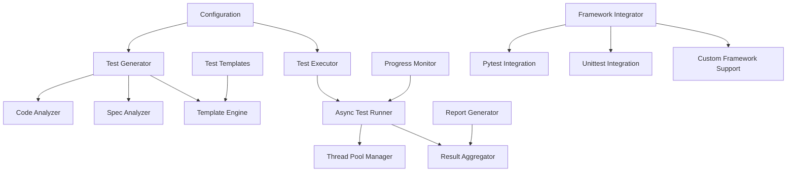

# Design Document

## Overview

The parallel test generator system provides automatic generation and concurrent execution of comprehensive unit tests. The system uses async/await patterns and thread pools for efficient concurrent execution without subprocess overhead. It integrates with existing testing frameworks and supports custom test generation templates for different code patterns and testing strategies.

## Architecture

### Core Components



### System Architecture

The system follows an async-first architecture with the following layers:

1. **Analysis Layer**: Code and specification analysis for test generation
2. **Generation Layer**: Template-based test case creation
3. **Execution Layer**: Concurrent test execution using asyncio
4. **Monitoring Layer**: Real-time progress tracking and performance monitoring
5. **Integration Layer**: Framework integration and result reporting

## Components and Interfaces

### 1. Test Generator (`test_generation/test_generator.py`)

**Purpose**: Orchestrate test generation from code analysis and specifications.

**Key Methods**:
- `async def generate_tests_from_code(file_path: str) -> List[TestCase]`
- `async def generate_tests_from_spec(spec_path: str) -> List[TestCase]`
- `async def generate_integration_tests(components: List[Component]) -> List[TestCase]`
- `async def batch_generate_tests(sources: List[str]) -> TestSuite`

**Interfaces**:
```python
class TestCase:
    name: str
    description: str
    test_code: str
    imports: List[str]
    fixtures: List[str]
    parameters: Optional[List[Dict[str, Any]]]
    expected_outcome: TestOutcome
    tags: List[str]

class TestSuite:
    name: str
    test_cases: List[TestCase]
    setup_code: Optional[str]
    teardown_code: Optional[str]
    dependencies: List[str]
    estimated_duration: float

class TestGenerationConfig:
    template_style: str  # pytest, unittest, custom
    coverage_level: CoverageLevel  # basic, comprehensive, exhaustive
    include_edge_cases: bool
    generate_property_tests: bool
    max_test_cases_per_function: int
    async_test_support: bool
```

### 2. Code Analyzer (`test_generation/code_analyzer.py`)

**Purpose**: Analyze Python code to extract testable behaviors and patterns.

**Key Methods**:
- `async def analyze_module(file_path: str) -> ModuleTestInfo`
- `async def extract_testable_functions(module: ast.Module) -> List[FunctionTestInfo]`
- `async def analyze_class_methods(class_node: ast.ClassDef) -> List[MethodTestInfo]`
- `async def detect_test_patterns(code: str) -> List[TestPattern]`

**Data Structures**:
```python
class FunctionTestInfo:
    name: str
    parameters: List[ParameterInfo]
    return_type: Optional[str]
    raises_exceptions: List[str]
    side_effects: List[str]
    complexity: int
    is_async: bool
    docstring_examples: List[str]

class MethodTestInfo(FunctionTestInfo):
    class_name: str
    is_static: bool
    is_class_method: bool
    access_level: str  # public, private, protected
    overrides_parent: bool

class TestPattern:
    pattern_type: str  # factory, validator, api_endpoint, etc.
    test_strategy: str
    required_fixtures: List[str]
    test_templates: List[str]
```

### 3. Spec Analyzer (`test_generation/spec_analyzer.py`)

**Purpose**: Analyze specification documents to generate validation tests.

**Key Methods**:
- `async def analyze_requirements(requirements_file: str) -> List[RequirementTest]`
- `async def extract_acceptance_criteria_tests(criteria: List[AcceptanceCriteria]) -> List[TestCase]`
- `async def generate_ears_format_tests(ears_statement: str) -> List[TestCase]`
- `async def create_integration_tests_from_design(design_doc: str) -> List[TestCase]`

**Data Structures**:
```python
class RequirementTest:
    requirement_id: str
    test_cases: List[TestCase]
    acceptance_criteria: List[str]
    test_data: List[Dict[str, Any]]
    validation_rules: List[str]

class EarsTestCase(TestCase):
    when_condition: str
    then_action: str
    shall_behavior: str
    test_data_variants: List[Dict[str, Any]]
```

### 4. Template Engine (`test_generation/template_engine.py`)

**Purpose**: Generate test code using customizable templates.

**Key Methods**:
- `async def render_test_template(template_name: str, context: Dict[str, Any]) -> str`
- `async def load_custom_templates(template_dir: str) -> None`
- `async def generate_parametrized_tests(function_info: FunctionTestInfo) -> str`
- `async def create_mock_setup(dependencies: List[str]) -> str`

**Template System**:
```python
class TestTemplate:
    name: str
    framework: str  # pytest, unittest
    pattern: str  # unit, integration, property
    template_code: str
    required_context: List[str]
    optional_context: List[str]

class TemplateContext:
    function_name: str
    class_name: Optional[str]
    parameters: List[ParameterInfo]
    return_type: Optional[str]
    test_data: List[Dict[str, Any]]
    mocks: List[str]
    fixtures: List[str]
```

### 5. Async Test Executor (`test_generation/async_executor.py`)

**Purpose**: Execute generated tests concurrently using asyncio and thread pools.

**Key Methods**:
- `async def execute_test_suite(test_suite: TestSuite) -> TestResults`
- `async def run_concurrent_tests(test_cases: List[TestCase]) -> List[TestResult]`
- `async def execute_with_timeout(test_case: TestCase, timeout: float) -> TestResult`
- `async def monitor_execution_progress(test_suite: TestSuite) -> AsyncIterator[ProgressUpdate]`

**Execution Architecture**:
```python
class AsyncTestExecutor:
    max_concurrent_tests: int
    thread_pool: ThreadPoolExecutor
    semaphore: asyncio.Semaphore
    progress_callback: Optional[Callable[[ProgressUpdate], None]]
    
    async def execute_test_batch(self, tests: List[TestCase]) -> List[TestResult]
    async def handle_test_timeout(self, test: TestCase) -> TestResult
    async def aggregate_results(self, results: List[TestResult]) -> TestSuiteResult

class TestResult:
    test_name: str
    status: TestStatus  # passed, failed, error, skipped
    duration: float
    error_message: Optional[str]
    stack_trace: Optional[str]
    coverage_data: Optional[CoverageInfo]
    performance_metrics: Dict[str, float]

class ProgressUpdate:
    completed_tests: int
    total_tests: int
    current_test: Optional[str]
    elapsed_time: float
    estimated_remaining: float
    failed_tests: int
```

### 6. Framework Integrator (`test_generation/framework_integrator.py`)

**Purpose**: Integrate with existing testing frameworks and tools.

**Key Methods**:
- `async def integrate_with_pytest(test_suite: TestSuite) -> str`
- `async def create_unittest_module(test_cases: List[TestCase]) -> str`
- `async def generate_conftest_py(fixtures: List[str]) -> str`
- `async def create_test_discovery_config() -> Dict[str, Any]`

**Integration Patterns**:
```python
class PytestIntegrator:
    async def generate_pytest_tests(self, test_cases: List[TestCase]) -> str
    async def create_fixtures(self, fixture_specs: List[FixtureSpec]) -> str
    async def generate_parametrize_decorators(self, test_data: List[Dict]) -> str
    async def create_async_test_wrappers(self, async_tests: List[TestCase]) -> str

class UnittestIntegrator:
    async def generate_unittest_class(self, test_cases: List[TestCase]) -> str
    async def create_setup_teardown_methods(self, setup_code: str) -> str
    async def generate_assertion_methods(self, test_case: TestCase) -> str
```

## Data Models

### Core Data Structures

```python
class TestGenerationRequest:
    source_type: SourceType  # code, spec, mixed
    source_paths: List[str]
    config: TestGenerationConfig
    output_format: OutputFormat
    execution_config: ExecutionConfig

class TestSuiteResult:
    suite_name: str
    total_tests: int
    passed_tests: int
    failed_tests: int
    error_tests: int
    skipped_tests: int
    total_duration: float
    coverage_percentage: float
    test_results: List[TestResult]
    performance_summary: PerformanceSummary

class PerformanceSummary:
    generation_time: float
    execution_time: float
    peak_memory_usage: float
    concurrent_tests_peak: int
    thread_pool_efficiency: float
    bottlenecks: List[str]

class CoverageInfo:
    lines_covered: int
    total_lines: int
    branches_covered: int
    total_branches: int
    missing_lines: List[int]
    coverage_percentage: float
```

## Error Handling

### Error Categories

1. **Generation Errors**: Template rendering failures, invalid code analysis
2. **Execution Errors**: Test runtime failures, timeout errors
3. **Concurrency Errors**: Thread pool exhaustion, async task failures
4. **Integration Errors**: Framework compatibility issues, import failures

### Error Handling Strategy

```python
class TestGenerationError(Exception):
    error_type: ErrorType
    source_file: Optional[str]
    context: Dict[str, Any]
    recovery_suggestions: List[str]

class AsyncErrorHandler:
    async def handle_generation_error(self, error: GenerationError) -> RecoveryAction
    async def handle_execution_error(self, error: ExecutionError) -> RecoveryAction
    async def handle_timeout_error(self, test: TestCase) -> TestResult
    async def aggregate_error_reports(self, errors: List[TestGenerationError]) -> ErrorSummary
```

### Recovery Strategies

- **Graceful Degradation**: Continue with simpler test generation when complex patterns fail
- **Timeout Management**: Implement progressive timeout strategies for long-running tests
- **Resource Management**: Monitor and limit concurrent resource usage
- **Fallback Templates**: Use basic templates when custom templates fail

## Testing Strategy

### Unit Testing

- **Template Engine Tests**: Validate template rendering with various contexts
- **Code Analyzer Tests**: Test AST parsing and pattern detection
- **Async Executor Tests**: Test concurrent execution and error handling
- **Framework Integration Tests**: Validate pytest and unittest integration

### Integration Testing

- **End-to-End Generation**: Full test generation from sample codebases
- **Concurrent Execution**: Test async execution with various load patterns
- **Framework Compatibility**: Test with different Python and framework versions
- **Performance Testing**: Validate execution speed and resource usage

### Test Data and Fixtures

```python
class TestFixtures:
    sample_python_modules: List[str]
    sample_specifications: List[str]
    expected_test_outputs: List[str]
    performance_benchmarks: Dict[str, float]
    error_scenarios: List[ErrorScenario]
```

## Performance Considerations

### Concurrency Design

- **Async-First Architecture**: Use asyncio for I/O-bound operations
- **Thread Pool Management**: Dedicated thread pools for CPU-bound test execution
- **Semaphore-Based Limiting**: Control concurrent test execution
- **Progressive Batching**: Dynamically adjust batch sizes based on performance

### Resource Management

```python
class ResourceManager:
    max_concurrent_tests: int
    thread_pool_size: int
    memory_limit: int
    timeout_strategy: TimeoutStrategy
    
    async def acquire_test_slot(self) -> AsyncContextManager
    async def monitor_resource_usage(self) -> ResourceMetrics
    async def adjust_concurrency_limits(self, metrics: ResourceMetrics) -> None
```

### Optimization Strategies

- **Template Caching**: Cache compiled templates for reuse
- **Incremental Generation**: Only regenerate tests for changed code
- **Smart Batching**: Group similar tests for efficient execution
- **Memory Management**: Stream results for large test suites

## Integration Points

### MCP Server Integration

Extend the existing MCP server with test generation capabilities:

```python
# New MCP tools:
- generate_tests_from_code
- generate_tests_from_spec
- execute_test_suite_async
- monitor_test_execution
- generate_test_report
```

### CI/CD Integration

```python
class CICDIntegrator:
    async def integrate_with_github_actions(self, project_path: str) -> str
    async def create_test_workflow(self, config: CICDConfig) -> str
    async def generate_coverage_reports(self, results: TestSuiteResult) -> str
    async def create_quality_gates(self, thresholds: QualityThresholds) -> str
```

### Existing Framework Integration

- **Code Generator**: Reuse AST analysis patterns
- **Advanced Validator**: Extend validation for test quality
- **Reverse Engineering**: Generate tests for reverse-engineered specs
- **Ontology Framework**: Special handling for RDF/SPARQL testing

## Configuration and Customization

### Configuration Schema

```yaml
test_generation:
  concurrency:
    max_concurrent_tests: 10
    thread_pool_size: 4
    timeout_default: 30.0
    timeout_max: 300.0
    
  generation:
    template_style: "pytest"  # pytest, unittest, custom
    coverage_level: "comprehensive"  # basic, comprehensive, exhaustive
    include_edge_cases: true
    generate_property_tests: false
    max_tests_per_function: 5
    
  execution:
    fail_fast: false
    capture_output: true
    verbose_reporting: true
    performance_monitoring: true
    
  integration:
    framework: "pytest"
    custom_templates_dir: "./test_templates"
    output_directory: "./generated_tests"
    report_format: ["json", "html", "junit"]
```

### Customization Points

- **Template System**: Custom Jinja2 templates for different test patterns
- **Pattern Detection**: Custom code pattern matchers
- **Execution Strategies**: Pluggable execution backends
- **Report Formats**: Multiple output formats for different tools
## R
eflectiveModule Integration (Steal from Hackathon)

**Critical Architectural Decision**: Instead of building our own observability infrastructure, steal the proven ReflectiveModule implementation from the hackathon directory.

### Why Steal Instead of Build

The hackathon's `unified_reflective_module.py` provides battle-tested capabilities that would take weeks to implement:

**Source**: `/Users/lou/kiro-2/kiro-ai-development-hackathon/src/rm_ddd/core/unified_reflective_module.py`

### Automatic Capabilities We Get

```python
from src.rm_ddd.core.unified_reflective_module import ReflectiveModule

class TestGenerator(ReflectiveModule):
    """Test generator with comprehensive observability powers."""
    
    async def generate_tests_from_code(self, file_path: str) -> TestSuite:
        with self.trace_operation("generate_tests", file_path=file_path) as trace:
            # Real-time observation emission
            self.emit_observation(
                f"Generating tests from {file_path}",
                event_type="api_request", 
                emoji="🧪"
            )
            
            # Your generation logic here
            result = await self._analyze_and_generate(file_path)
            
            # Automatic performance tracking
            trace.output_result = result
            return result

class AsyncTestExecutor(ReflectiveModule):
    """Test executor with systematic observability."""
    
    async def execute_test_suite(self, test_suite: TestSuite) -> TestSuiteResult:
        with self.trace_operation("execute_suite", total_tests=len(test_suite.test_cases)) as trace:
            self.emit_observation(
                f"Executing {len(test_suite.test_cases)} tests in parallel",
                event_type="deployment",
                emoji="⚡"
            )
            
            result = await self._execute_parallel(test_suite)
            trace.output_result = result
            return result
```

### Zero-Configuration Benefits

**Prometheus Metrics**: Automatic registration and collection
- Operation counts, durations, error rates
- Resource usage (memory, CPU)
- Test execution performance metrics

**Health Endpoints**: Available immediately
- `/health` - Component health status
- `/ready` - Readiness for test execution  
- `/metrics` - Prometheus metrics endpoint

**CLI Interface**: Generated automatically
```python
# Automatic CLI generation through method introspection
test_gen = TestGenerator()
cli_interface = test_gen.get_cli_interface()
help_text = test_gen.generate_cli_help()

# Execute commands programmatically
result = test_gen.execute_cli_command("generate_tests_from_code", file_path="test.py")
```

**Operation Tracing**: Complete audit trails
- Correlation IDs for request tracking
- Performance metrics (duration, memory usage)
- Input/output capture for debugging
- Error context and stack traces

**Observatory Integration**: Real-time monitoring
- Live activity feed for test generation and execution
- Performance dashboards
- Error tracking and alerting

**CMS Integration**: Configuration management
- Store test generation templates in Directus
- Manage execution policies and thresholds
- Version control for test configurations

### Implementation Strategy

1. **Copy the ReflectiveModule**: Bring `unified_reflective_module.py` into our codebase
2. **Refactor Existing Classes**: Make all components inherit from ReflectiveModule
3. **Add Observability**: Use `trace_operation()` and `emit_observation()` throughout
4. **Enable Features**: Configure Prometheus, Observatory, and CMS integration
5. **Generate CLIs**: Leverage automatic CLI generation for all components

### Integration with DAG Orchestration

The ReflectiveModule provides the perfect foundation for DAG orchestration integration:

```python
class DAGAwareTestExecutor(ReflectiveModule):
    """Test executor with DAG orchestration and full observability."""
    
    def __init__(self):
        super().__init__()
        self.dag_orchestrator = DAGOrchestrator()  # Also inherits ReflectiveModule
    
    async def execute_with_dag_optimization(self, test_suite: TestSuite) -> TestSuiteResult:
        with self.trace_operation("dag_optimized_execution") as trace:
            # Analyze test dependencies
            dag = await self.dag_orchestrator.build_test_dag(test_suite)
            
            # Emit observation
            self.emit_observation(
                f"Optimized execution plan: {dag.parallelization_factor}x speedup expected",
                event_type="performance",
                emoji="🚀"
            )
            
            # Execute with DAG optimization
            result = await self.dag_orchestrator.execute_dag(dag)
            trace.output_result = result
            return result
```

This approach gives us enterprise-grade observability, monitoring, and integration capabilities without building any infrastructure ourselves.