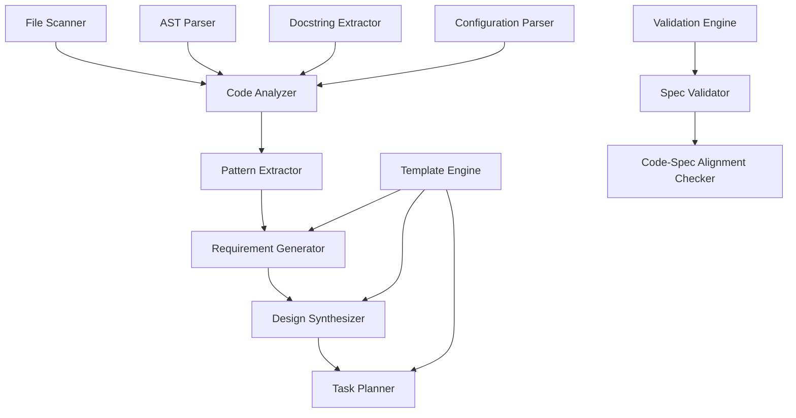

# Design Document

## Overview

The reverse engineering specification system will analyze existing code implementations to automatically generate comprehensive specification documents. The system leverages the existing AI-assisted capabilities in the ontology framework, extending the code analysis patterns found in modules like `CodeGenerator`, `AdvancedValidator`, and the MCP server infrastructure to create a comprehensive reverse engineering pipeline.

## Architecture

### Core Components



### System Architecture

The system follows a modular pipeline architecture with the following layers:

1. **Input Layer**: File scanning and parsing
2. **Analysis Layer**: Code structure and pattern analysis
3. **Extraction Layer**: Requirement and design pattern extraction
4. **Generation Layer**: Specification document generation
5. **Validation Layer**: Quality assurance and alignment checking

## Components and Interfaces

### 1. Code Analyzer (`reverse_engineering/code_analyzer.py`)

**Purpose**: Analyze Python modules, ontology files, and configuration files to extract structural information.

**Key Methods**:
- `analyze_python_module(file_path: str) -> ModuleAnalysis`
- `analyze_ontology_file(file_path: str) -> OntologyAnalysis`
- `analyze_configuration(file_path: str) -> ConfigAnalysis`
- `extract_dependencies(file_path: str) -> DependencyGraph`

**Interfaces**:
```python
class ModuleAnalysis:
    classes: List[ClassInfo]
    functions: List[FunctionInfo]
    imports: List[ImportInfo]
    docstrings: Dict[str, str]
    decorators: List[DecoratorInfo]
    error_handling: List[ErrorPattern]

class ClassInfo:
    name: str
    methods: List[MethodInfo]
    inheritance: List[str]
    decorators: List[str]
    docstring: Optional[str]
    design_patterns: List[str]

class FunctionInfo:
    name: str
    parameters: List[ParameterInfo]
    return_type: Optional[str]
    docstring: Optional[str]
    complexity: int
    error_handling: List[str]
```

### 2. Pattern Extractor (`reverse_engineering/pattern_extractor.py`)

**Purpose**: Identify design patterns, architectural decisions, and implementation strategies from analyzed code.

**Key Methods**:
- `extract_design_patterns(analysis: ModuleAnalysis) -> List[DesignPattern]`
- `identify_architectural_patterns(modules: List[ModuleAnalysis]) -> ArchitecturalPattern`
- `extract_api_patterns(analysis: ModuleAnalysis) -> List[APIPattern]`
- `analyze_data_flow(modules: List[ModuleAnalysis]) -> DataFlowPattern`

**Design Pattern Detection**:
- Factory Pattern: Classes with `create_*` methods
- Strategy Pattern: Classes with interchangeable algorithms
- Observer Pattern: Event handling and callback patterns
- Singleton Pattern: Classes with instance management
- MCP Pattern: Tool registration and handler patterns

### 3. Requirement Generator (`reverse_engineering/requirement_generator.py`)

**Purpose**: Generate EARS-format requirements from extracted patterns and code analysis.

**Key Methods**:
- `generate_functional_requirements(analysis: ModuleAnalysis) -> List[Requirement]`
- `generate_user_stories(patterns: List[DesignPattern]) -> List[UserStory]`
- `extract_acceptance_criteria(function_info: FunctionInfo) -> List[AcceptanceCriteria]`
- `generate_non_functional_requirements(analysis: ModuleAnalysis) -> List[Requirement]`

**Template-Based Generation**:
```python
class RequirementTemplate:
    pattern: str  # e.g., "API_ENDPOINT", "VALIDATION_RULE"
    user_story_template: str
    acceptance_criteria_template: List[str]
    
    def generate_requirement(self, context: Dict[str, Any]) -> Requirement
```

### 4. Design Synthesizer (`reverse_engineering/design_synthesizer.py`)

**Purpose**: Create comprehensive design documents from extracted patterns and requirements.

**Key Methods**:
- `synthesize_architecture(modules: List[ModuleAnalysis]) -> ArchitectureDesign`
- `generate_component_diagrams(patterns: List[DesignPattern]) -> List[Diagram]`
- `extract_data_models(ontology_analysis: OntologyAnalysis) -> List[DataModel]`
- `document_interfaces(api_patterns: List[APIPattern]) -> List[InterfaceSpec]`

**Output Structures**:
```python
class ArchitectureDesign:
    overview: str
    components: List[ComponentSpec]
    interfaces: List[InterfaceSpec]
    data_models: List[DataModel]
    error_handling: ErrorHandlingStrategy
    testing_strategy: TestingStrategy
```

### 5. Task Planner (`reverse_engineering/task_planner.py`)

**Purpose**: Generate implementation task lists based on code structure and patterns.

**Key Methods**:
- `generate_task_breakdown(design: ArchitectureDesign) -> TaskList`
- `extract_testing_tasks(test_files: List[str]) -> List[Task]`
- `generate_deployment_tasks(config_analysis: ConfigAnalysis) -> List[Task]`
- `create_integration_tasks(dependencies: DependencyGraph) -> List[Task]`

### 6. Spec Validator (`reverse_engineering/spec_validator.py`)

**Purpose**: Validate generated specifications and check alignment with code.

**Key Methods**:
- `validate_spec_completeness(spec: Specification) -> ValidationResult`
- `check_code_spec_alignment(code_analysis: ModuleAnalysis, spec: Specification) -> AlignmentResult`
- `identify_missing_implementations(requirements: List[Requirement], code: ModuleAnalysis) -> List[Gap]`
- `validate_test_coverage(requirements: List[Requirement], test_files: List[str]) -> CoverageReport`

## Data Models

### Core Data Structures

```python
class Specification:
    requirements: RequirementsDocument
    design: DesignDocument
    tasks: TaskDocument
    metadata: SpecMetadata

class RequirementsDocument:
    introduction: str
    requirements: List[Requirement]
    user_stories: List[UserStory]
    
class Requirement:
    id: str
    title: str
    user_story: UserStory
    acceptance_criteria: List[AcceptanceCriteria]
    priority: Priority
    source_code: List[str]  # Files that informed this requirement

class AcceptanceCriteria:
    id: str
    description: str
    format: str  # EARS format (WHEN/IF/THEN/SHALL)
    source_function: Optional[str]
    test_coverage: bool

class DesignDocument:
    overview: str
    architecture: ArchitectureDesign
    components: List[ComponentSpec]
    interfaces: List[InterfaceSpec]
    data_models: List[DataModel]
    error_handling: ErrorHandlingStrategy
    testing_strategy: TestingStrategy

class TaskDocument:
    tasks: List[Task]
    dependencies: TaskDependencyGraph
    estimated_effort: Dict[str, int]

class Task:
    id: str
    title: str
    description: str
    subtasks: List[Task]
    requirements_refs: List[str]
    source_files: List[str]
    optional: bool
```

## Error Handling

### Error Categories

1. **Parse Errors**: Invalid Python syntax, malformed ontology files
2. **Analysis Errors**: Unable to extract patterns or structure
3. **Generation Errors**: Template rendering failures, incomplete data
4. **Validation Errors**: Spec-code misalignment, missing coverage

### Error Handling Strategy

```python
class ReverseEngineeringError(Exception):
    category: ErrorCategory
    source_file: Optional[str]
    context: Dict[str, Any]
    suggestions: List[str]

class ErrorHandler:
    def handle_parse_error(self, error: ParseError) -> RecoveryAction
    def handle_analysis_error(self, error: AnalysisError) -> RecoveryAction
    def log_error_with_context(self, error: ReverseEngineeringError) -> None
    def generate_error_report(self, errors: List[ReverseEngineeringError]) -> ErrorReport
```

### Recovery Strategies

- **Partial Analysis**: Continue processing other files when one fails
- **Fallback Templates**: Use generic templates when specific patterns aren't detected
- **Manual Intervention Points**: Flag areas requiring human review
- **Incremental Processing**: Process files in dependency order

## Testing Strategy

### Unit Testing

- **Code Analyzer Tests**: Test parsing of various Python constructs
- **Pattern Extractor Tests**: Verify design pattern detection accuracy
- **Template Engine Tests**: Validate requirement generation templates
- **Validator Tests**: Test spec-code alignment checking

### Integration Testing

- **End-to-End Pipeline**: Full reverse engineering of sample projects
- **MCP Integration**: Test integration with existing MCP server
- **File Format Support**: Test various input file formats (Python, TTL, YAML, JSON)
- **Large Codebase Testing**: Performance testing on complex projects

### Test Data

```python
class TestFixtures:
    sample_python_modules: List[str]
    sample_ontology_files: List[str]
    sample_config_files: List[str]
    expected_requirements: List[Requirement]
    expected_design_patterns: List[DesignPattern]
```

### Performance Testing

- **Large File Processing**: Test with files >1000 lines
- **Complex Inheritance**: Test deep class hierarchies
- **Circular Dependencies**: Test handling of circular imports
- **Memory Usage**: Monitor memory consumption during analysis

## Integration Points

### MCP Server Integration

Extend the existing `EnhancedOntologyMCPServer` with reverse engineering tools:

```python
# New MCP tools to add:
- reverse_engineer_module
- generate_spec_from_code
- validate_spec_alignment
- extract_requirements
- analyze_code_patterns
```

### Existing Framework Integration

- **Code Generator**: Reuse AST parsing and class analysis patterns
- **Advanced Validator**: Extend validation patterns for spec checking
- **AI Assistant**: Leverage natural language processing for requirement generation
- **CI/CD Pipeline**: Integrate spec generation into build process

### File System Integration

```python
class FileSystemIntegration:
    def scan_project_structure(self, root_path: str) -> ProjectStructure
    def identify_file_types(self, files: List[str]) -> Dict[str, FileType]
    def create_spec_directory(self, project_path: str) -> str
    def update_existing_specs(self, spec_path: str, updates: SpecUpdates) -> None
```

## Configuration and Customization

### Configuration Schema

```yaml
reverse_engineering:
  analysis:
    include_patterns: ["*.py", "*.ttl", "*.yaml", "*.json"]
    exclude_patterns: ["*test*", "*__pycache__*"]
    max_file_size: 1048576  # 1MB
    
  requirements:
    template_style: "ears"  # ears, gherkin, custom
    include_non_functional: true
    generate_user_stories: true
    
  design:
    include_diagrams: true
    diagram_format: "mermaid"
    architecture_style: "layered"
    
  tasks:
    include_testing_tasks: true
    mark_optional_tests: true
    estimate_effort: false
    
  validation:
    strict_alignment: false
    require_test_coverage: true
    min_coverage_threshold: 0.8
```

### Customization Points

- **Template System**: Custom requirement and design templates
- **Pattern Detection**: Custom design pattern definitions
- **Output Formats**: Multiple specification document formats
- **Integration Hooks**: Pre/post processing hooks for custom logic