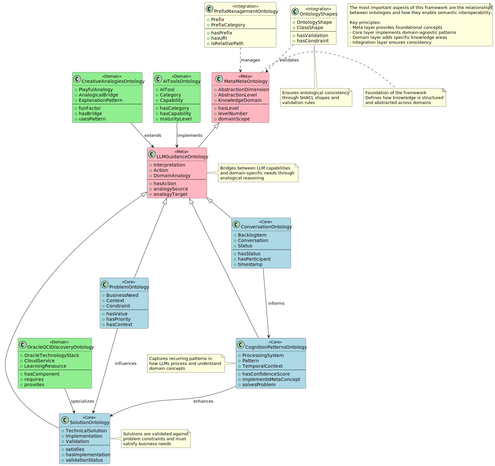

# Ontology Framework

A flexible ontology framework designed to leverage LLMs for semantic constraint enforcement and rich domain modeling capabilities, with lossless transformations between modeling formats.

## Overview

This framework provides:

- Semantic constraint enforcement for LLM responses
- Rich domain modeling with lossless transformations
- Tiered architecture promoting reuse
- Extensible model structures
- Multi-format projections (Turtle, UML, ERD, etc.)

## Framework Architecture



The framework is built on a layered architecture with meta, base, and domain-specific components.

## Implementation Flow


The implementation follows a layered architecture with clear dependencies:

### 1. Infrastructure Layer 🔧
Foundation layer providing essential development and testing capabilities:
- GitHub Workflow: Branch protection, PR reviews, and automated checks
- Repository Structure: Clean organization of code, models, and examples
- Integration Testing: Comprehensive test framework for all components

### 2. Core Features Layer ✅
Core functionality enabling ontology management and validation:
- Constraint Validation: SHACL-based validation with custom extensions
- Performance Optimization: Caching and efficient processing
- Format Transformations: Lossless conversion between formats

### 3. Advanced Features Layer 🔍
Enhanced capabilities building on core features:
- Vector Database: Semantic search and similarity matching
- Collaborative Development: Version control and merge resolution
- Vocabulary Suggestions: AI-powered term recommendations

### 4. Examples Layer 🎸
Reference implementations demonstrating framework usage:
- Root Alignment: Examples aligned with core ontologies
- Elvis Porkenheimer: Comprehensive domain example
- LLM Generation: AI-generated ontology demonstrations

Dependencies flow downward, ensuring:
- Clear separation of concerns
- Modular development
- Testable components
- Progressive enhancement

## Installation

> **Note:** This project is currently in early development. The Python implementation is not yet available - see the Implementation Status section for progress tracking.

```bash
# Create conda environment
conda env create -f environment.yml

# Activate environment
conda activate ontology-framework
```

## Related Work

This project builds upon several recent advances in combining ontologies with LLMs:

1. **Ontology-based Query Checking** [^1]: Demonstrates using ontologies to:

   - Validate LLM-generated queries
   - Provide semantic error detection
   - Enable query repair through LLM feedback loops
   - Improve accuracy from 54% to 72% through ontological validation

2. **LLMs4OL Framework** [^2]: Provides capabilities for:

   - Term typing
   - Taxonomy discovery
   - Non-taxonomic relation extraction
   - Evaluation across multiple knowledge domains

Our framework extends these approaches by focusing specifically on semantic constraint enforcement and lossless transformations between modeling formats.

## Implementation Status

### Infrastructure Layer
- [x] GitHub workflow setup (#20)
- [ ] Repository structure refactor (#2)
- [ ] Integration testing framework (#9)

### Core Features
- [ ] Enhanced constraint validation (#7)
- [ ] Performance optimization (#8)
- [ ] Format transformations (#6)

### Advanced Features
- [ ] Vector database integration (#5)
- [ ] Collaborative development (#10)
- [ ] Vocabulary suggestions (#11)

### Examples
- [ ] Root ontology alignment (#1)
- [ ] Elvis Porkenheimer ontology (#3)
- [ ] LLM-generated example (#4)

## License

AGPL License - see [LICENSE](LICENSE "AGPL license.") file for details.

## References

[^1]: Allemang, D., & Sequeda, J. (2024). Increasing the LLM Accuracy for Question Answering: Ontologies to the Rescue! [arXiv:2405.11706](https://arxiv.org/abs/2405.11706)
    
[^2]: Babaei Giglou, H., D'Souza, J., & Auer, S. (2023). LLMs4OL: Large Language Models for Ontology Learning. [ISWC 2023](https://link.springer.com/chapter/10.1007/978-3-031-47240-4_22)
