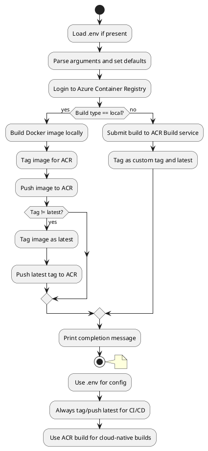
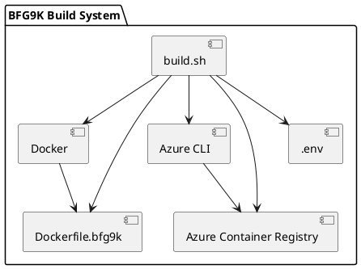
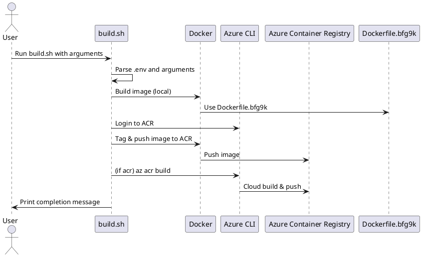

# BFG9K Build & Run Instructions

## 🚀 build.sh Usage

Build and push your Docker image to Azure Container Registry (ACR) or locally.

```bash
./build.sh [local|acr] [platform] [dockerfile] [image_name] [tag]
```

**Arguments:**
- `local|acr` — Build locally with Docker or remotely with Azure ACR Build (default: `acr`)
- `platform` — Target platform (default: `linux/amd64`)
- `dockerfile` — Dockerfile to use (default: `Dockerfile.bfg9k`)
- `image_name` — Name of the image (default: `bfg9k-mcp-sse` or your override)
- `tag` — Image tag (default: current timestamp)

**Examples:**

- **Local build, default Dockerfile, default image name:**
  ```bash
  ./build.sh local
  ```

- **Local build, custom image name and tag:**
  ```bash
  ./build.sh local linux/amd64 Dockerfile.bfg9k my-image-name mytag
  ```

- **ACR build (default):**
  ```bash
  ./build.sh
  ```

- **ACR build, custom image name:**
  ```bash
  ./build.sh acr linux/amd64 Dockerfile.bfg9k bfg9k-mcp-sse
  ```

---

## 🗂️ Activity Diagram: build.sh



---

## 🏗️ Static Structure Diagram: build.sh Components & Dependencies



**Legend:**
- `build.sh`: The build script
- `Docker`: Local Docker engine
- `Azure CLI`: Azure command-line interface
- `Azure Container Registry`: Remote image registry
- `Dockerfile.bfg9k`: Build instructions for the image
- `.env`: Environment variable configuration

---

## 📡 Communication Diagram: build.sh Workflow



---

## 🚀 run.sh Usage

Run your image locally with Docker or deploy to Azure Container Instances (ACI).

```bash
./run.sh [local|aci] [image_name] [tag] [port] [aci_name] [resource_group] [cpu] [memory] [vnet_name|subnet_id] [subnet_name] [vnet_resource_group]
```

**Arguments:**
- `local|aci` — Run locally with Docker or deploy to ACI (default: `local`)
- `image_name` — Name of the image (default: `bfg9k-mcp-sse`)
- `tag` — Image tag (default: `latest`)
- `port` — Port to expose (default: `8080`)
- `aci_name` — Name for the ACI container group (default: same as image name)
- `resource_group` — Azure resource group (default: your configured group)
- `cpu` — Number of CPUs (default: `1`)
- `memory` — Memory in GB (default: `2`)
- `vnet_name|subnet_id` — (ACI only) VNet name or full subnet resource ID
- `subnet_name` — (ACI only) Subnet name (if using VNet name)
- `vnet_resource_group` — (ACI only) Resource group for VNet (default: your configured group)

**Examples:**

- **Run locally (Docker):**
  ```bash
  ./run.sh local bfg9k-mcp-sse latest 8080
  ```

- **Deploy to ACI (public IP):**
  ```bash
  ./run.sh aci bfg9k-mcp-sse latest 8080 my-aci-name my-resource-group
  ```

- **Deploy to ACI (private subnet):**
  ```bash
  ./run.sh aci bfg9k-mcp-sse latest 8080 my-aci-name my-resource-group 1 2 my-vnet my-subnet my-vnet-resource-group
  ```

- **Deploy to ACI (using full subnet resource ID):**
  ```bash
  ./run.sh aci bfg9k-mcp-sse latest 8080 my-aci-name my-resource-group 1 2 /subscriptions/xxxx/resourceGroups/rg/providers/Microsoft.Network/virtualNetworks/vnet/subnets/subnet
  ```

---

## 📝 Tips
- You can set defaults in a `.env` file in your project root.
- Always check the output for errors or missing arguments.
- For troubleshooting, check the container logs:
  ```bash
  az container logs --resource-group <your-group> --name <your-aci-name>
  ``` 