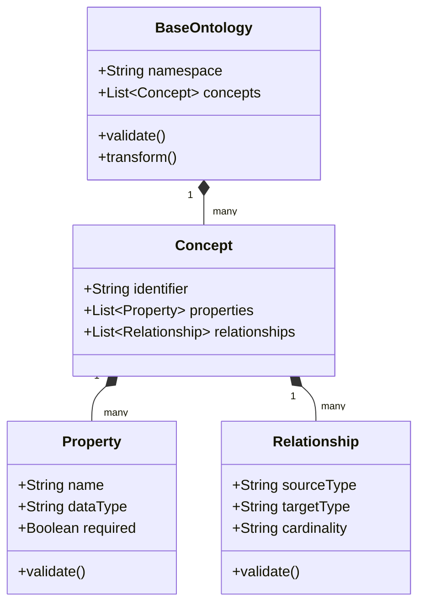

# Ontology Framework Example

## Overview

This example demonstrates how the ontology framework can be used to create and transform models while maintaining semantic integrity and enabling rich domain modeling capabilities.

## Base Model Structure



The diagram above shows the core structure of our base ontology model:

1. **BaseOntology**: The root container that holds all concepts and provides validation/transformation capabilities
2. **Concept**: Represents a domain entity with properties and relationships
3. **Property**: Defines attributes of a concept with data types and validation rules
4. **Relationship**: Defines connections between concepts with cardinality rules

## Project Structure

```
ontology-framework/
├── src/
│   ├── ontologies/
│   │   ├── base/
│   │   │   └── base.ttl    # Base ontology definitions
│   │   └── transform/
│   │       └── transform.ttl # Transformation ontology
│   └── models/
│       └── base.sql        # SQL schema representation
└── docs/
    ├── diagrams/
    │   └── base-model.puml # UML representation
    └── EXAMPLE.md          # This file
```

The framework supports lossless transformations between different representations (Turtle, UML, SQL) while maintaining semantic constraints and relationships defined in the base ontology.
