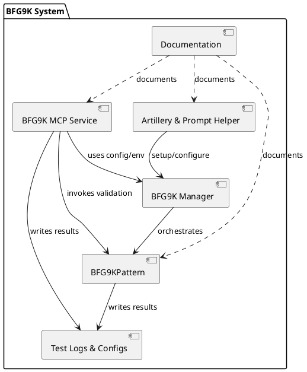
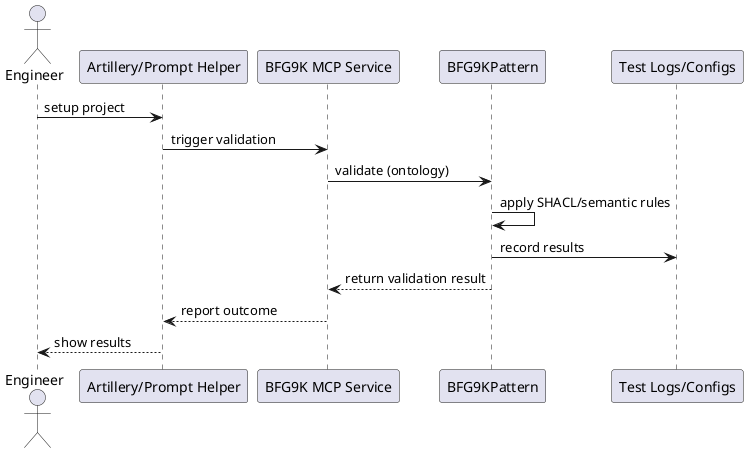

# BFG9K & Ontology Framework: DRY Scientific Overview

## 1. Key Components

- **BFG9KPattern (`bfg9k_pattern.py`)**: Core validation engine combining SHACL, semantic, and pattern-based rules.
- **BFG9K MCP Service (`bfg9k_mcp.py`)**: Exposes validation and governance as callable tools/services (Model Context Protocol).
- **BFG9K Manager (`bfg9k_manager.py`)**: Orchestrates configuration, environment, and service integration.
- **Artillery & Prompt Helper (`bfg9k_artillery.py`, `bfg9k_prompt_helper.py`)**: CLI and natural language interfaces for rapid setup and automation.
- **Test Logs & Configs (`test_logs/`, `tests/bfg9k_test_config.json`)**: Evidence and configuration for validation, regression, and smoke testing.
- **Documentation (`README.md`, `SPORE_CONCEPT.md`, `docs/architecture/`)**: Guides, concepts, and architecture references.

## 2. Typical Workflows

### a. Ontology Validation & Governance
1. **Prefix Normalization**: Run `fix_prefixes_tool` to ensure all IRIs are absolute and well-formed.
2. **Validation**: Use `validate_turtle_tool` (via MCP or CLI) to check syntax, SHACL, and semantic rules.
3. **Governance Enforcement**: BFG9KPattern applies modular, traceable governance rules (e.g., spores, patches, conformance tracking).
4. **Automation**: Integrate validation into CI/CD or authoring pipelines using the MCP service.

### b. Authoring & Onboarding
1. **Project Setup**: Use `bfg9k_artillery.py` or prompt helper for rapid environment and ontology file creation.
2. **Pattern Registration**: Register new transformation patterns (spores) and associated SHACL shapes.
3. **Continuous Validation**: Monitor and validate changes using test logs and automated workflows.

## 3. Stakeholders & Tool Users
- **Ontology Engineers**: Use validation, prefix, and governance tools for authoring and maintenance.
- **Governance Leads**: Rely on traceability, conformance, and audit features for compliance.
- **Developers/Integrators**: Leverage MCP service for automation, integration, and CI/CD.
- **New Contributors**: Onboard via documented workflows and guided setup tools.

## 4. Why These Tools? Why This Framework?
- **DRY Principle**: Centralized, reusable configs and validation logic prevent duplication and drift.
- **Traceability**: Every change, rule, and patch is modular and auditable (spores, logs, governance artifacts).
- **Automation**: MCP service enables validation and governance to be embedded in pipelines and tools.
- **Governance**: Explicit, machine-checkable rules ensure compliance and continuous improvement.
- **Scalability**: Modular patterns (BFG9K, spores) support growth and adaptation across projects.

## 5. The Role of BFG9K MCP
- **Service Layer**: Operationalizes the BFG9K pattern as callable tools (validate, fix, enforce) for both humans and machines.
- **Integration Point**: Connects validation logic to CI/CD, authoring tools, and external systems.
- **Governance Enforcer**: Ensures that all ontology changes pass through traceable, auditable validation gates.

## 8. PDCA (Plan-Do-Check-Adjust) in the BFG9K Ontology Framework

The BFG9K system and ontology framework are inspired by the Plan-Do-Check-Adjust (PDCA) cycle for continuous improvement:

- **Plan:** Define validation rules, governance patterns, and project objectives (via configs, spores, and setup tools).
- **Do:** Execute validation and governance enforcement using BFG9KPattern, MCP service, and CLI tools.
- **Check:** Review validation results, conformance logs, and audit trails (test logs, validation outputs).
- **Adjust:** Refine rules, patterns, and processes based on findings. (Currently a manual or semi-automated process; future work will focus on automating feedback and continuous improvement.)

> **Note:** The Plan, Do, and Check phases are well-supported and partially automated. The Adjust phase is an area for future enhancement—enabling more automated feedback and continuous improvement.

---

**Summary:**
The BFG9K system and ontology framework provide a DRY, modular, and automated approach to ontology validation and governance. By combining robust validation engines, service-oriented architecture, and clear documentation, the framework supports scalable, compliant, and collaborative knowledge engineering. 

## 6. Component Dependency Diagram

## 7. Validation Workflow Interaction Diagram

## 9. Use Cases & Integration Scenarios

- **IDE-Assisted Validation:** Users working in Cursor IDE can leverage LLM-powered assistance (e.g., Claude) for ontology authoring and troubleshooting. Validation and governance enforcement are performed by the bfg9k_mcp service, which integrates with the BFG9KPattern engine. This enables seamless, DRY, and automated workflows directly from the IDE.

- **See also:** [Cursor IDE, LLM, and BFG9K_MCP Integration Diagram](CURSOR_BFG9K_INTEGRATION.md) for a visual overview of these interactions. 