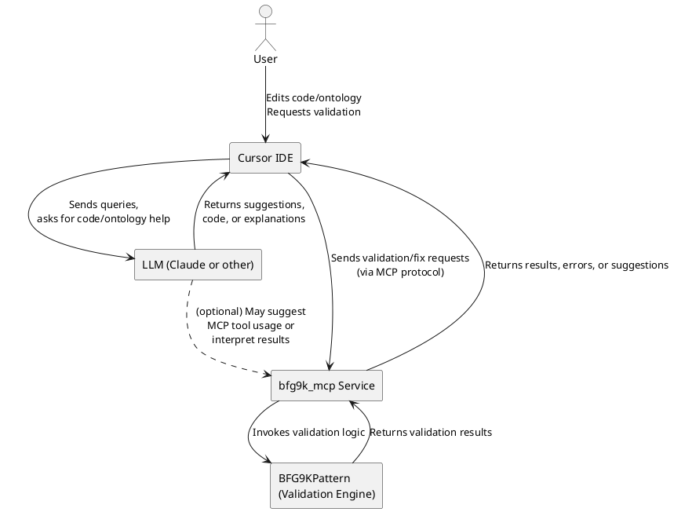

## Cursor IDE, LLM, and BFG9K_MCP Integration Diagram

```plantuml
@startuml Cursor_BFG9K_Integration

actor User

rectangle "Cursor IDE" as IDE
rectangle "LLM (Claude or other)" as LLM
rectangle "bfg9k_mcp Service" as MCP
rectangle "BFG9KPattern\n(Validation Engine)" as Pattern

User --> IDE : Edits code/ontology\nRequests validation
IDE --> LLM : Sends queries,\nasks for code/ontology help
LLM --> IDE : Returns suggestions,\ncode, or explanations

IDE --> MCP : Sends validation/fix requests\n(via MCP protocol)
MCP --> Pattern : Invokes validation logic
Pattern --> MCP : Returns validation results
MCP --> IDE : Returns results, errors, or suggestions

LLM ..> MCP : (optional) May suggest\nMCP tool usage or\ninterpret results

@enduml
``` 