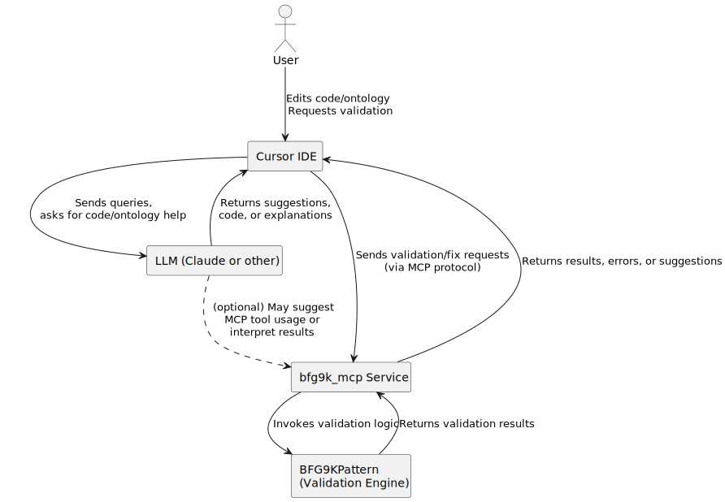

## Cursor IDE, LLM, and BFG9K_MCP Integration Diagram

> **Note:** (update_markdown_with_svgs.py) The SVG below is rendered from the PlantUML diagram for GitHub compatibility.

[View PlantUML source](cursor_bfg9k_integration.puml)
 