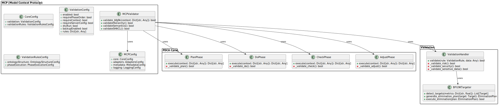
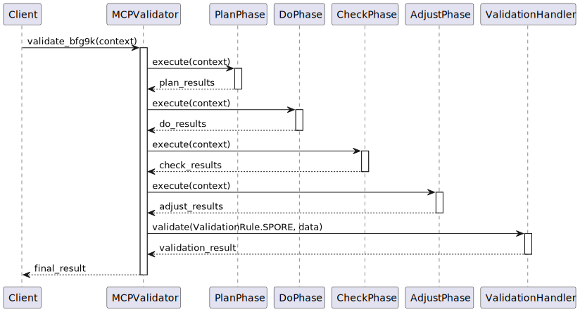

# BFG9K Pattern and MCP System Architecture

## Overview

The BFG9K pattern is a specialized validation component within the Model Context Protocol (MCP) system, designed to handle large-scale validation and security measures with overwhelming force. The name is a playful homage to the iconic BFG9000 from Doom, reflecting its role as a powerful, decisive tool in the validation arsenal. Unlike its namesake, this version can safely be pointed at the user - at least in validation mode. Mostly.

The MCP (Model Context Protocol) implements a robust Plan-Do-Check-Adjust (PDCA) cycle for continuous improvement and validation. This cycle consists of:

1. **Plan**: Define objectives and processes to deliver results
2. **Do**: Implement the plan and execute the process
3. **Check**: Measure and monitor results against objectives
4. **Adjust**: Take actions to improve the process based on results

This document illustrates the relationship between these components through static structure and communication diagrams.

## Static Structure

> **Note:** The SVG below is rendered from the PlantUML diagram for GitHub compatibility.



[View PlantUML source](BFG9K-MCP_Relationship.puml)

### Static Structure Explanation

The static structure diagram shows the hierarchical relationship between the MCP system and its PDCA cycle components. The MCP (Model Context Protocol) serves as the overarching framework, with the PDCA cycle being its core process improvement methodology.

#### Key Components:

1. **MCP Core**:
   - `MCPValidator`: The main validation orchestrator that coordinates all validation activities
   - `MCPConfig`: Manages the unified configuration structure
   - `CoreConfig`: Core validation settings and rules
   - `ValidationConfig`: Validation-specific settings
   - `ValidationRulesConfig`: Ontology structure and phase execution rules

2. **PDCA Cycle**:
   - `PlanPhase`: Defines objectives and processes
   - `DoPhase`: Implements planned changes
   - `CheckPhase`: Measures and monitors results
   - `AdjustPhase`: Improves processes based on results

3. **Validation Support**:
   - `ValidationHandler`: Manages specific validation rules and checks
   - `BFG9KTargeter`: Implements targeting and elimination strategies

## Communication Flow

> **Note:** The SVG below is rendered from the PlantUML diagram for GitHub compatibility.



[View PlantUML source](PDCA_Communication_Flow.puml)

### Communication Flow Explanation

The communication diagram illustrates the flow of the PDCA cycle through the system. The process follows these steps:

1. **Client Request**:
   - A client initiates validation by calling the MCPValidator's `validate_bfg9k` method

2. **Plan Phase**:
   - Define objectives and processes
   - Establish validation rules and requirements
   - Create implementation plan

3. **Do Phase**:
   - Execute planned changes
   - Generate and modify files as needed
   - Apply validation rules

4. **Check Phase**:
   - Measure results against objectives
   - Validate implementation
   - Identify issues and deviations

5. **Adjust Phase**:
   - Analyze check results
   - Generate necessary adjustments
   - Provide recommendations for improvement

6. **Validation**:
   - Final validation of all changes
   - Ensure compliance with requirements
   - Return final results to client

## Integration Points

### Configuration Management
- The system uses a unified configuration structure in `mcp.json`:
  ```json
  {
    "core": {
      "validation": {
        "enabled": true,
        "requirePhaseOrder": true,
        "requireContext": true,
        "requireServerConfig": true,
        "dryRun": false,
        "backupEnabled": true,
        "rules": {
          "phaseOrder": [
            "plan",
            "do",
            "check",
            "adjust"
          ],
          "requiredPhases": [
            "plan",
            "do",
            "check",
            "adjust"
          ]
        }
      },
      "validationRules": { ... }
    },
    "adapters": { ... },
    "metadata": { ... },
    "logging": { ... }
  }
  ```

### PDCA Cycle Implementation
- Each phase has specific responsibilities:
  - **Plan**: Define objectives and processes
  - **Do**: Implement planned changes
  - **Check**: Measure and validate results
  - **Adjust**: Improve based on findings
- Phases are coordinated through the MCPValidator
- Results from each phase contribute to the final outcome

## Conclusion

This architecture ensures a robust, flexible validation system where the PDCA cycle serves as the core process improvement methodology within the broader MCP framework. The system provides continuous improvement capabilities while maintaining integration with validation and security requirements. 