# MCP Validator Static Structure Analysis

## Model-Driven Documentation

This documentation follows the MCP's self-referential model structure, where each component is defined both in terms of its implementation and its semantic meaning within the validation framework.

### Semantic Definitions

```turtle
@prefix : <https://raw.githubusercontent.com/louspringer/ontology-framework/main/guidance#> .
@prefix rdf: <http://www.w3.org/1999/02/22-rdf-syntax-ns#> .
@prefix rdfs: <http://www.w3.org/2000/01/rdf-schema#> .
@prefix owl: <http://www.w3.org/2002/07/owl#> .
@prefix sh: <http://www.w3.org/ns/shacl#> .

:ValidatorComponent a owl:Class ;
    rdfs:label "Validator Component"@en ;
    rdfs:comment "A component of the MCP validation system"@en .

:MCPValidator a :ValidatorComponent ;
    rdfs:label "MCP Validator"@en ;
    rdfs:comment "Core validation engine implementing the BFG9K pattern"@en ;
    :hasMethod [
        :methodName "validate" ;
        :returnType "Dict[str, Dict[str, Any]]" ;
        :parameterTypes ["Path"] ;
        :semanticMeaning "Main validation orchestration method"
    ] .

:ValidationTarget a :ValidatorComponent ;
    rdfs:label "Validation Target"@en ;
    rdfs:comment "Represents a target for validation"@en ;
    :hasProperty [
        :propertyName "uri" ;
        :propertyType "URIRef" ;
        :semanticMeaning "Unique identifier of the target"
    ] .

:ChangeImpact a owl:Class ;
    rdfs:label "Change Impact"@en ;
    rdfs:comment "Impact of changes on validator components"@en .

:RequiresUpdate a owl:ObjectProperty ;
    rdfs:label "requires update"@en ;
    rdfs:comment "Indicates that changes to one component require updates to another"@en .
```

## Change Impact DAG (Semantic Version)

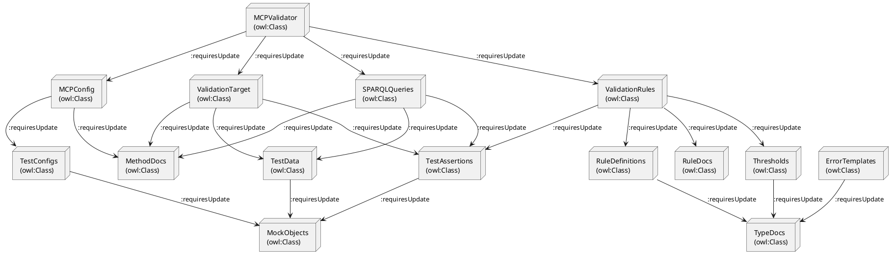

## LLM-Friendly Change Rules

### Method Change Rules (Semantic)

```turtle
:MethodChange a owl:Class ;
    rdfs:label "Method Change"@en ;
    rdfs:comment "Changes to method signatures or implementations"@en ;
    :triggersUpdate [
        :targetComponent :Tests ;
        :updateType "required" ;
        :semanticReason "Maintain test coverage"
    ] ;
    :triggersUpdate [
        :targetComponent :Documentation ;
        :updateType "required" ;
        :semanticReason "Maintain accuracy"
    ] .
```

### Validation Rule Change Rules (Semantic)

```turtle
:ValidationRuleChange a owl:Class ;
    rdfs:label "Validation Rule Change"@en ;
    rdfs:comment "Changes to validation rules or constraints"@en ;
    :triggersUpdate [
        :targetComponent :TestData ;
        :updateType "required" ;
        :semanticReason "Ensure test data validity"
    ] ;
    :triggersUpdate [
        :targetComponent :TestAssertions ;
        :updateType "required" ;
        :semanticReason "Maintain test validity"
    ] .
```

## LLM Processing Guidelines

1. **Semantic Understanding**
   - Each component is defined with both implementation and semantic meaning
   - Relationships are expressed using RDF/OWL semantics
   - Changes are modeled as semantic events with clear impacts

2. **Change Detection**
   - Monitor for changes in method signatures
   - Track modifications to validation rules
   - Detect configuration updates
   - Identify documentation changes

3. **Impact Analysis**
   - Use semantic reasoning to determine affected components
   - Apply change rules to identify required updates
   - Generate update recommendations based on semantic relationships

4. **Documentation Updates**
   - Maintain semantic consistency across all documentation
   - Update related components based on semantic relationships
   - Ensure documentation reflects current implementation

## LLM Integration Example

```python
def analyze_change_impact(change_type: str, component: str) -> List[Dict[str, Any]]:
    """
    Analyzes the impact of a change using semantic reasoning.
    
    Args:
        change_type: Type of change (method, rule, config, doc)
        component: Component being changed
        
    Returns:
        List of required updates with semantic reasoning
    """
    # Load semantic model
    graph = Graph()
    graph.parse("validator_model.ttl", format="turtle")
    
    # Query for impact
    query = """
        PREFIX : <https://raw.githubusercontent.com/louspringer/ontology-framework/main/guidance#>
        SELECT ?target ?reason WHERE {
            ?change a :{change_type}Change .
            ?change :triggersUpdate ?update .
            ?update :targetComponent ?target .
            ?update :semanticReason ?reason .
        }
    """
    
    return [
        {
            "target": str(result["target"]),
            "reason": str(result["reason"])
        }
        for result in graph.query(query)
    ]
```

## Semantic Validation Rules

```turtle
:ChangeValidation a owl:Class ;
    rdfs:label "Change Validation"@en ;
    rdfs:comment "Rules for validating changes"@en ;
    :hasRule [
        :ruleType "method_change" ;
        :requiresTestUpdate true ;
        :requiresDocUpdate true ;
        :semanticConstraint "Maintain type safety"
    ] ;
    :hasRule [
        :ruleType "rule_change" ;
        :requiresTestDataUpdate true ;
        :requiresAssertionUpdate true ;
        :semanticConstraint "Maintain validation integrity"
    ] .
```

## LLM Processing Workflow

1. **Change Detection**
   ```turtle
   :ChangeDetection a owl:Class ;
       rdfs:label "Change Detection"@en ;
       rdfs:comment "Process for detecting changes"@en ;
       :hasStep [
           :stepType "monitor" ;
           :targetComponent :MethodSignatures
       ] ;
       :hasStep [
           :stepType "analyze" ;
           :targetComponent :ValidationRules
       ] .
   ```

2. **Impact Analysis**
   ```turtle
   :ImpactAnalysis a owl:Class ;
       rdfs:label "Impact Analysis"@en ;
       rdfs:comment "Process for analyzing change impacts"@en ;
       :usesReasoning [
           :reasoningType "semantic" ;
           :targetOntology :ValidatorModel
       ] .
   ```

3. **Update Generation**
   ```turtle
   :UpdateGeneration a owl:Class ;
       rdfs:label "Update Generation"@en ;
       rdfs:comment "Process for generating required updates"@en ;
       :generates [
           :updateType "test" ;
           :updateType "documentation" ;
           :updateType "configuration"
       ] .
   ```

## Internal Structure

### Class Diagram

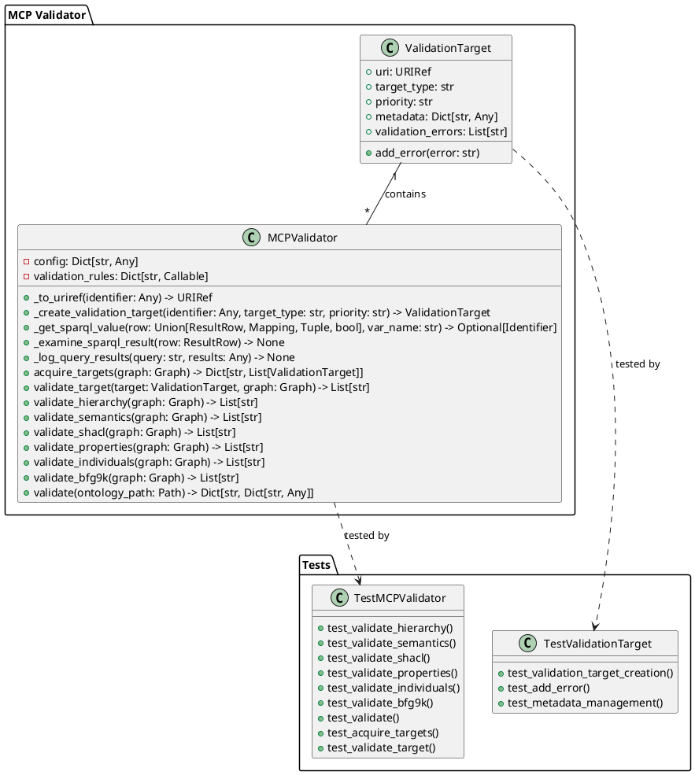

### Component Diagram

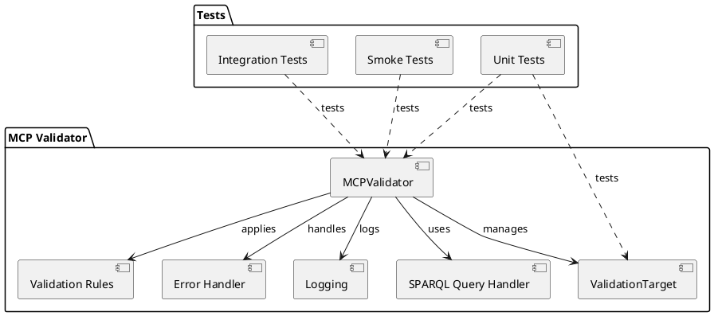

## Method Signatures

### MCPValidator Core Methods

```python
def validate(self, ontology_path: Path) -> Dict[str, Dict[str, Any]]:
    """
    Main validation method that orchestrates the entire validation process.
    Returns a dictionary containing validation results and errors.
    """

def validate_bfg9k(self, graph: Graph) -> List[str]:
    """
    Validates the ontology against the BFG9K pattern.
    Returns a list of validation errors.
    """

def acquire_targets(self, graph: Graph) -> Dict[str, List[ValidationTarget]]:
    """
    Identifies and categorizes validation targets from the ontology graph.
    Returns a dictionary mapping target types to lists of ValidationTarget objects.
    """

def validate_target(self, target: ValidationTarget, graph: Graph) -> List[str]:
    """
    Validates a single target against the ontology graph.
    Returns a list of validation errors specific to the target.
    """
```

### ValidationTarget Methods

```python
def __init__(self, uri: URIRef, target_type: str, priority: str):
    """
    Initializes a new ValidationTarget with the given URI, type, and priority.
    """

def add_error(self, error: str) -> None:
    """
    Adds a validation error to the target's error list.
    """
```

## Test Implementation

### Unit Tests

```python
def test_validate_hierarchy(self):
    """
    Tests the hierarchy validation functionality.
    Verifies that class hierarchies are properly validated.
    """

def test_validate_semantics(self):
    """
    Tests the semantic validation functionality.
    Verifies that semantic relationships are properly validated.
    """

def test_validate_shacl(self):
    """
    Tests the SHACL validation functionality.
    Verifies that SHACL constraints are properly validated.
    """
```

### Integration Tests

```python
def test_bfg9k_smoke_test(self):
    """
    Tests the complete BFG9K validation process.
    Verifies that the entire validation pipeline works correctly.
    """

def test_validation_pipeline(self):
    """
    Tests the complete validation pipeline.
    Verifies that all validation steps are executed in the correct order.
    """
```

## Test Dependencies

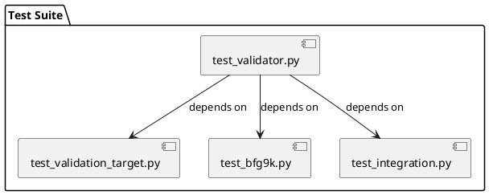

## Test Data Flow

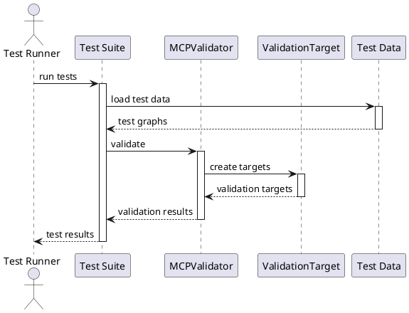

## Test Configuration

```json
{
  "test_config": {
    "test_graphs": {
      "valid": "tests/data/valid_ontology.ttl",
      "invalid": "tests/data/invalid_ontology.ttl",
      "bfg9k": "tests/data/bfg9k_test.ttl"
    },
    "validation_rules": {
      "hierarchy": true,
      "semantics": true,
      "shacl": true,
      "bfg9k": true
    }
  }
}
```

## Test Coverage

1. **Unit Tests**
   - Individual method validation
   - Error handling
   - Edge cases
   - Input validation

2. **Integration Tests**
   - Complete validation pipeline
   - BFG9K pattern validation
   - Cross-component interactions

3. **Smoke Tests**
   - Basic functionality
   - Critical paths
   - Performance benchmarks

## Test Maintenance

When `validator.py` changes, the following tests need to be updated:

1. **Method Signature Changes**
   - Update corresponding test method signatures
   - Update test data structures
   - Update validation expectations

2. **New Validation Rules**
   - Add new test cases
   - Update test data
   - Add new test configurations

3. **BFG9K Pattern Updates**
   - Update BFG9K test suite
   - Add new pattern test cases
   - Update integration tests

4. **Error Handling Changes**
   - Update error test cases
   - Add new error scenarios
   - Update error message expectations 

## Change Impact Analysis

### Monitored Components

The following components are actively monitored for changes:

1. **Core Components**
   - `MCPValidator` class and its methods
   - `ValidationTarget` class and its methods
   - SPARQL query templates
   - Validation rule implementations

2. **Configuration**
   - `mcp_config.json`
   - Validation rule definitions
   - Priority thresholds
   - Error message templates

3. **Test Components**
   - Test data files
   - Test configurations
   - Test assertions
   - Mock objects

4. **Documentation**
   - Method signatures
   - Return types
   - Parameter types
   - Validation rules

### Change Impact DAG

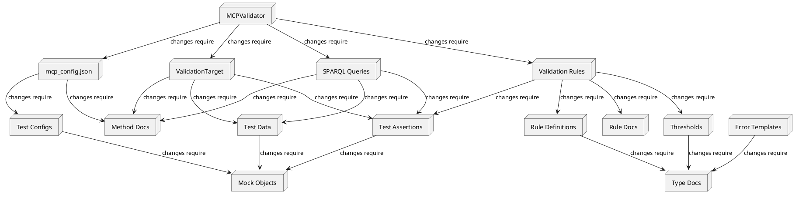

### Change Impact Rules

1. **Method Signature Changes**
   ```plantuml
   @startuml Method Change Impact
   
   node "Method Change" as MC
   node "Tests" as T
   node "Documentation" as D
   node "Type Definitions" as TD
   node "Mock Objects" as MO
   
   MC --> T : requires update
   MC --> D : requires update
   MC --> TD : may require update
   MC --> MO : may require update
   
   @enduml
   ```

2. **Validation Rule Changes**
   ```plantuml
   @startuml Rule Change Impact
   
   node "Rule Change" as RC
   node "Test Data" as TD
   node "Test Assertions" as TA
   node "Config" as C
   node "Documentation" as D
   
   RC --> TD : requires update
   RC --> TA : requires update
   RC --> C : may require update
   RC --> D : requires update
   
   @enduml
   ```

3. **Configuration Changes**
   ```plantuml
   @startuml Config Change Impact
   
   node "Config Change" as CC
   node "Test Configs" as TC
   node "Validation Logic" as VL
   node "Documentation" as D
   
   CC --> TC : requires update
   CC --> VL : may require update
   CC --> D : requires update
   
   @enduml
   ```

### Change Monitoring Process

1. **Automated Checks**
   - Type checking
   - Test coverage
   - Documentation coverage
   - Configuration validation

2. **Manual Reviews**
   - Method signature changes
   - Validation rule updates
   - Configuration modifications
   - Documentation updates

3. **Impact Assessment**
   - Test suite updates needed
   - Documentation updates needed
   - Configuration updates needed
   - Dependent component updates needed

### Change Validation Rules

```json
{
  "change_validation": {
    "method_changes": {
      "require_test_update": true,
      "require_doc_update": true,
      "require_type_check": true
    },
    "rule_changes": {
      "require_test_data_update": true,
      "require_assertion_update": true,
      "require_config_check": true
    },
    "config_changes": {
      "require_test_config_update": true,
      "require_validation_check": true
    }
  }
}
```

### Change Impact Checklist

When making changes to any component, verify:

1. **Method Changes**
   - [ ] Update corresponding tests
   - [ ] Update documentation
   - [ ] Verify type compatibility
   - [ ] Update mock objects if needed

2. **Rule Changes**
   - [ ] Update test data
   - [ ] Update test assertions
   - [ ] Verify configuration compatibility
   - [ ] Update rule documentation

3. **Configuration Changes**
   - [ ] Update test configurations
   - [ ] Verify validation logic
   - [ ] Update configuration documentation
   - [ ] Test with existing data

4. **Documentation Changes**
   - [ ] Verify method signatures
   - [ ] Update type definitions
   - [ ] Update examples
   - [ ] Verify accuracy 

## LLM Live Fire Testing Framework

### Prompt-Based Test Structure

```turtle
:LLMTest a owl:Class ;
    rdfs:label "LLM Live Fire Test"@en ;
    rdfs:comment "Test that interacts with LLM in real-time"@en ;
    :hasComponent [
        :componentType "prompt" ;
        :semanticMeaning "Test prompt for LLM interaction"
    ] ;
    :hasComponent [
        :componentType "telemetry" ;
        :semanticMeaning "Data gathered during test execution"
    ] ;
    :hasComponent [
        :componentType "validation" ;
        :semanticMeaning "BFG9K validation rules"
    ] .

:TestTelemetry a owl:Class ;
    rdfs:label "Test Telemetry"@en ;
    rdfs:comment "Data gathered during LLM test execution"@en ;
    :hasMetric [
        :metricName "response_time" ;
        :semanticMeaning "Time taken for LLM response"
    ] ;
    :hasMetric [
        :metricName "accuracy" ;
        :semanticMeaning "Accuracy of LLM response"
    ] ;
    :hasMetric [
        :metricName "confidence" ;
        :semanticMeaning "LLM confidence in response"
    ] .
```

### BFG9K Targeting Process

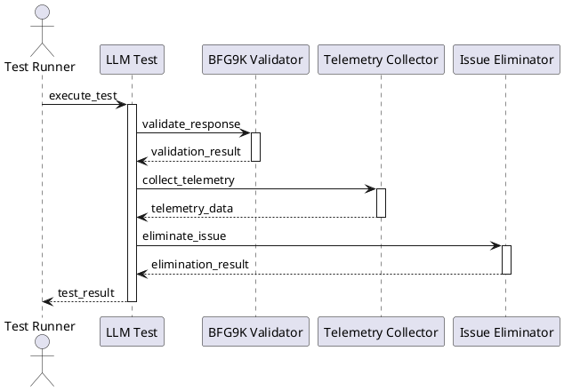

### Example Prompt-Based Test

```python
class LLMValidatorTest:
    """Test class for LLM live fire testing"""
    
    def test_semantic_understanding(self):
        """Test LLM's understanding of semantic relationships"""
        prompt = """
        Given the following semantic definition:
        {semantic_definition}
        
        Please:
        1. Identify all components and their relationships
        2. Explain the semantic meaning of each component
        3. Predict the impact of changes to any component
        """
        
        # Execute test with telemetry collection
        result = self.execute_llm_test(
            prompt=prompt,
            expected_components=["ValidatorComponent", "MCPValidator", "ValidationTarget"],
            telemetry_metrics=["response_time", "accuracy", "confidence"]
        )
        
        # Validate with BFG9K
        validation_result = self.bfg9k_validate(result)
        
        # Collect telemetry
        telemetry = self.collect_telemetry(
            test_name="semantic_understanding",
            validation_result=validation_result,
            llm_response=result
        )
        
        # Eliminate issues if found
        if validation_result.has_issues:
            self.eliminate_issues(validation_result, telemetry)
```

### BFG9K Targeting Rules

```turtle
:BFG9KTarget a owl:Class ;
    rdfs:label "BFG9K Target"@en ;
    rdfs:comment "Target for BFG9K validation and elimination"@en ;
    :hasRule [
        :ruleType "semantic_validation" ;
        :targetComponent :LLMResponse ;
        :validationCriteria [
            :criterion "component_identification" ;
            :threshold 0.85
        ]
    ] ;
    :hasRule [
        :ruleType "relationship_validation" ;
        :targetComponent :SemanticRelationships ;
        :validationCriteria [
            :criterion "relationship_accuracy" ;
            :threshold 0.90
        ]
    ] .

:TelemetryTarget a owl:Class ;
    rdfs:label "Telemetry Target"@en ;
    rdfs:comment "Target for telemetry collection"@en ;
    :hasMetric [
        :metricName "response_quality" ;
        :collectionPoint "LLM_Response" ;
        :threshold 0.80
    ] ;
    :hasMetric [
        :metricName "validation_success" ;
        :collectionPoint "BFG9K_Validation" ;
        :threshold 0.95
    ] .
```

### Live Fire Test Execution

```python
def execute_llm_live_fire_test(self, test_config: Dict[str, Any]) -> TestResult:
    """
    Executes a live fire test with LLM interaction and BFG9K validation.
    
    Args:
        test_config: Configuration for the test
        
    Returns:
        TestResult with telemetry and validation data
    """
    # Initialize telemetry collection
    telemetry = TelemetryCollector()
    
    # Execute test with LLM
    llm_response = self.llm.execute_prompt(
        prompt=test_config["prompt"],
        context=test_config["context"]
    )
    
    # Validate with BFG9K
    validation_result = self.bfg9k.validate(
        response=llm_response,
        rules=test_config["validation_rules"]
    )
    
    # Collect telemetry
    telemetry.add_metric("response_time", llm_response.time_taken)
    telemetry.add_metric("accuracy", validation_result.accuracy)
    telemetry.add_metric("confidence", llm_response.confidence)
    
    # Eliminate issues if found
    if validation_result.has_issues:
        elimination_result = self.eliminate_issues(
            issues=validation_result.issues,
            telemetry=telemetry
        )
        telemetry.add_metric("elimination_success", elimination_result.success)
    
    return TestResult(
        llm_response=llm_response,
        validation_result=validation_result,
        telemetry=telemetry
    )
```

### Telemetry Collection Points

```turtle
:TelemetryCollectionPoint a owl:Class ;
    rdfs:label "Telemetry Collection Point"@en ;
    rdfs:comment "Point where telemetry is collected"@en ;
    :hasPoint [
        :pointName "prompt_execution" ;
        :metrics ["response_time", "token_count"]
    ] ;
    :hasPoint [
        :pointName "validation" ;
        :metrics ["accuracy", "confidence"]
    ] ;
    :hasPoint [
        :pointName "issue_elimination" ;
        :metrics ["success_rate", "time_taken"]
    ] .
```

### BFG9K Elimination Process

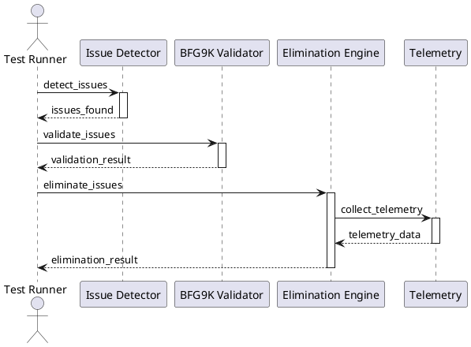

### Test Configuration Example

```json
{
  "llm_test_config": {
    "test_name": "semantic_understanding_test",
    "prompt_template": "analyze_semantic_relationships.prompt",
    "validation_rules": {
      "component_identification": {
        "threshold": 0.85,
        "telemetry_metrics": ["accuracy", "confidence"]
      },
      "relationship_validation": {
        "threshold": 0.90,
        "telemetry_metrics": ["response_time", "success_rate"]
      }
    },
    "telemetry_collection": {
      "points": ["prompt_execution", "validation", "issue_elimination"],
      "metrics": ["response_time", "accuracy", "confidence", "success_rate"]
    }
  }
}
```

## Hypercube Dimensional Analysis

### Hypercube Definition

```turtle
:HypercubeDimension a owl:Class ;
    rdfs:label "Hypercube Dimension"@en ;
    rdfs:comment "Dimension in the validation hypercube space"@en ;
    :hasDimension [
        :dimensionName "semantic_accuracy" ;
        :range [0.0, 1.0] ;
        :weight 0.3
    ] ;
    :hasDimension [
        :dimensionName "response_time" ;
        :range [0.0, 5.0] ;
        :weight 0.2
    ] ;
    :hasDimension [
        :dimensionName "confidence" ;
        :range [0.0, 1.0] ;
        :weight 0.25
    ] ;
    :hasDimension [
        :dimensionName "validation_success" ;
        :range [0.0, 1.0] ;
        :weight 0.25
    ] .

:TrajectoryVector a owl:Class ;
    rdfs:label "Trajectory Vector"@en ;
    rdfs:comment "Vector representing movement through hypercube space"@en ;
    :hasComponent [
        :componentType "velocity" ;
        :semanticMeaning "Rate of change in each dimension"
    ] ;
    :hasComponent [
        :componentType "acceleration" ;
        :semanticMeaning "Rate of change of velocity"
    ] ;
    :hasComponent [
        :componentType "jerk" ;
        :semanticMeaning "Rate of change of acceleration"
    ] .
```

### Hypercube Targeting Process

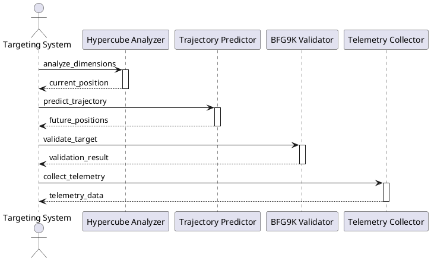

### Trajectory Analysis

```python
class HypercubeTrajectory:
    """Analyzes and predicts target movement in hypercube space"""
    
    def __init__(self, dimensions: List[HypercubeDimension]):
        self.dimensions = dimensions
        self.trajectory_history = []
        self.velocity_vectors = []
        self.acceleration_vectors = []
    
    def predict_future_position(self, 
                              current_position: Dict[str, float],
                              time_steps: int = 5) -> List[Dict[str, float]]:
        """
        Predicts future positions based on trajectory analysis.
        
        Args:
            current_position: Current position in hypercube space
            time_steps: Number of future steps to predict
            
        Returns:
            List of predicted future positions
        """
        # Calculate velocity vector
        velocity = self._calculate_velocity(current_position)
        
        # Calculate acceleration vector
        acceleration = self._calculate_acceleration(velocity)
        
        # Calculate jerk vector
        jerk = self._calculate_jerk(acceleration)
        
        # Predict future positions
        future_positions = []
        for step in range(time_steps):
            position = {}
            for dim in self.dimensions:
                # Position = p0 + v*t + 0.5*a*t² + (1/6)*j*t³
                t = step + 1
                position[dim.name] = (
                    current_position[dim.name] +
                    velocity[dim.name] * t +
                    0.5 * acceleration[dim.name] * t**2 +
                    (1/6) * jerk[dim.name] * t**3
                )
            future_positions.append(position)
        
        return future_positions
    
    def _calculate_velocity(self, current_position: Dict[str, float]) -> Dict[str, float]:
        """Calculates velocity vector from position history"""
        if len(self.trajectory_history) < 2:
            return {dim.name: 0.0 for dim in self.dimensions}
        
        velocity = {}
        for dim in self.dimensions:
            delta_pos = current_position[dim.name] - self.trajectory_history[-1][dim.name]
            delta_t = 1  # Assuming uniform time steps
            velocity[dim.name] = delta_pos / delta_t
        
        return velocity
    
    def _calculate_acceleration(self, velocity: Dict[str, float]) -> Dict[str, float]:
        """Calculates acceleration vector from velocity history"""
        if len(self.velocity_vectors) < 2:
            return {dim.name: 0.0 for dim in self.dimensions}
        
        acceleration = {}
        for dim in self.dimensions:
            delta_v = velocity[dim.name] - self.velocity_vectors[-1][dim.name]
            delta_t = 1  # Assuming uniform time steps
            acceleration[dim.name] = delta_v / delta_t
        
        return acceleration
    
    def _calculate_jerk(self, acceleration: Dict[str, float]) -> Dict[str, float]:
        """Calculates jerk vector from acceleration history"""
        if len(self.acceleration_vectors) < 2:
            return {dim.name: 0.0 for dim in self.dimensions}
        
        jerk = {}
        for dim in self.dimensions:
            delta_a = acceleration[dim.name] - self.acceleration_vectors[-1][dim.name]
            delta_t = 1  # Assuming uniform time steps
            jerk[dim.name] = delta_a / delta_t
        
        return jerk
```

### BFG9K Hypercube Targeting

```python
class BFG9KHypercubeTargeter:
    """Targets and eliminates issues using hypercube analysis"""
    
    def __init__(self, dimensions: List[HypercubeDimension]):
        self.trajectory = HypercubeTrajectory(dimensions)
        self.telemetry = TelemetryCollector()
    
    def target_issue(self, current_state: Dict[str, Any]) -> TargetingResult:
        """
        Targets an issue using hypercube analysis.
        
        Args:
            current_state: Current state of the system
            
        Returns:
            TargetingResult with predicted positions and elimination plan
        """
        # Analyze current position in hypercube
        current_position = self._analyze_position(current_state)
        
        # Predict future positions
        future_positions = self.trajectory.predict_future_position(
            current_position,
            time_steps=5
        )
        
        # Calculate optimal targeting vector
        targeting_vector = self._calculate_targeting_vector(
            current_position,
            future_positions
        )
        
        # Generate elimination plan
        elimination_plan = self._generate_elimination_plan(
            targeting_vector,
            future_positions
        )
        
        # Collect telemetry
        telemetry = self.telemetry.collect(
            current_position=current_position,
            future_positions=future_positions,
            targeting_vector=targeting_vector
        )
        
        return TargetingResult(
            current_position=current_position,
            future_positions=future_positions,
            targeting_vector=targeting_vector,
            elimination_plan=elimination_plan,
            telemetry=telemetry
        )
    
    def _analyze_position(self, state: Dict[str, Any]) -> Dict[str, float]:
        """Analyzes current position in hypercube space"""
        position = {}
        for dim in self.trajectory.dimensions:
            position[dim.name] = self._calculate_dimension_value(dim, state)
        return position
    
    def _calculate_targeting_vector(self,
                                  current: Dict[str, float],
                                  future: List[Dict[str, float]]) -> Dict[str, float]:
        """Calculates optimal targeting vector"""
        vector = {}
        for dim in self.trajectory.dimensions:
            # Calculate vector that minimizes distance to optimal position
            optimal = self._get_optimal_position(dim)
            current_val = current[dim.name]
            future_val = future[-1][dim.name]
            
            # Vector points towards optimal position
            vector[dim.name] = (optimal - current_val) / (future_val - current_val)
        
        return vector
```

### Hypercube Telemetry

```turtle
:HypercubeTelemetry a owl:Class ;
    rdfs:label "Hypercube Telemetry"@en ;
    rdfs:comment "Telemetry data from hypercube analysis"@en ;
    :hasMetric [
        :metricName "position_history" ;
        :semanticMeaning "Historical positions in hypercube space"
    ] ;
    :hasMetric [
        :metricName "velocity_history" ;
        :semanticMeaning "Historical velocity vectors"
    ] ;
    :hasMetric [
        :metricName "acceleration_history" ;
        :semanticMeaning "Historical acceleration vectors"
    ] ;
    :hasMetric [
        :metricName "targeting_accuracy" ;
        :semanticMeaning "Accuracy of targeting predictions"
    ] .
```

### Hypercube Visualization

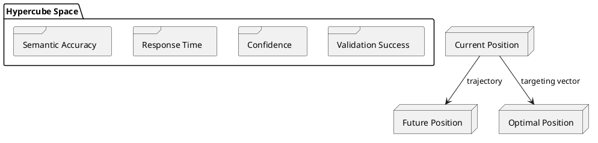

## Model Updates from Hypercube Analysis

### Update Triggers

```turtle
:HypercubeUpdate a owl:Class ;
    rdfs:label "Hypercube Analysis Update"@en ;
    rdfs:comment "Update triggered by hypercube analysis"@en ;
    :triggersUpdate [
        :updateType "model_refinement" ;
        :triggerCondition "trajectory_deviation > threshold" ;
        :updateTarget :OntologyModel
    ] ;
    :triggersUpdate [
        :updateType "rule_adjustment" ;
        :triggerCondition "validation_success < threshold" ;
        :updateTarget :ValidationRules
    ] ;
    :triggersUpdate [
        :updateType "dimension_reweighting" ;
        :triggerCondition "targeting_accuracy < threshold" ;
        :updateTarget :HypercubeDimensions
    ] .
```

### Update Process

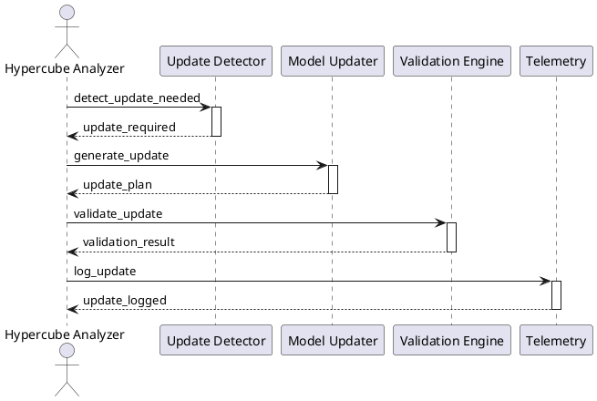

### Update Implementation

```python
class HypercubeModelUpdater:
    """Manages model updates based on hypercube analysis"""
    
    def __init__(self, ontology_model: Graph, validation_rules: Dict[str, Any]):
        self.ontology_model = ontology_model
        self.validation_rules = validation_rules
        self.update_history = []
    
    def process_hypercube_analysis(self, analysis_result: HypercubeAnalysis) -> List[ModelUpdate]:
        """
        Processes hypercube analysis results and generates necessary model updates.
        
        Args:
            analysis_result: Results from hypercube analysis
            
        Returns:
            List of model updates to apply
        """
        updates = []
        
        # Check for trajectory deviations
        if analysis_result.trajectory_deviation > self.thresholds["trajectory"]:
            updates.append(self._generate_model_refinement(analysis_result))
        
        # Check for validation success
        if analysis_result.validation_success < self.thresholds["validation"]:
            updates.append(self._adjust_validation_rules(analysis_result))
        
        # Check for targeting accuracy
        if analysis_result.targeting_accuracy < self.thresholds["targeting"]:
            updates.append(self._reweight_dimensions(analysis_result))
        
        return updates
    
    def _generate_model_refinement(self, analysis: HypercubeAnalysis) -> ModelUpdate:
        """Generates ontology model refinements based on trajectory analysis"""
        refinement = {
            "type": "model_refinement",
            "changes": [],
            "reason": "Trajectory deviation detected"
        }
        
        # Analyze semantic accuracy trajectory
        if analysis.trajectory["semantic_accuracy"].deviation > 0.1:
            refinement["changes"].append({
                "component": "semantic_definitions",
                "action": "refine",
                "details": analysis.trajectory["semantic_accuracy"].details
            })
        
        # Analyze validation success trajectory
        if analysis.trajectory["validation_success"].deviation > 0.1:
            refinement["changes"].append({
                "component": "validation_constraints",
                "action": "adjust",
                "details": analysis.trajectory["validation_success"].details
            })
        
        return ModelUpdate(**refinement)
    
    def _adjust_validation_rules(self, analysis: HypercubeAnalysis) -> ModelUpdate:
        """Adjusts validation rules based on success metrics"""
        adjustment = {
            "type": "rule_adjustment",
            "changes": [],
            "reason": "Validation success below threshold"
        }
        
        # Adjust rule thresholds
        for rule in self.validation_rules:
            if analysis.validation_metrics[rule] < self.thresholds[rule]:
                adjustment["changes"].append({
                    "rule": rule,
                    "action": "adjust_threshold",
                    "new_threshold": analysis.validation_metrics[rule] * 0.9
                })
        
        return ModelUpdate(**adjustment)
    
    def _reweight_dimensions(self, analysis: HypercubeAnalysis) -> ModelUpdate:
        """Recomputes dimension weights based on targeting accuracy"""
        reweighting = {
            "type": "dimension_reweighting",
            "changes": [],
            "reason": "Targeting accuracy below threshold"
        }
        
        # Calculate new weights based on performance
        total_performance = sum(
            analysis.dimension_performance[dim] 
            for dim in self.dimensions
        )
        
        for dim in self.dimensions:
            new_weight = (
                analysis.dimension_performance[dim] / 
                total_performance
            )
            reweighting["changes"].append({
                "dimension": dim,
                "action": "update_weight",
                "new_weight": new_weight
            })
        
        return ModelUpdate(**reweighting)
```

### Update Validation

```turtle
:ModelUpdateValidation a owl:Class ;
    rdfs:label "Model Update Validation"@en ;
    rdfs:comment "Validation rules for model updates"@en ;
    :hasRule [
        :ruleType "consistency_check" ;
        :validationCondition "No contradictory updates" ;
        :severity "HIGH"
    ] ;
    :hasRule [
        :ruleType "impact_analysis" ;
        :validationCondition "Minimal side effects" ;
        :severity "MEDIUM"
    ] ;
    :hasRule [
        :ruleType "performance_check" ;
        :validationCondition "Maintains or improves performance" ;
        :severity "HIGH"
    ] .
```

### Update Telemetry

```turtle
:UpdateTelemetry a owl:Class ;
    rdfs:label "Update Telemetry"@en ;
    rdfs:comment "Telemetry data for model updates"@en ;
    :hasMetric [
        :metricName "update_frequency" ;
        :semanticMeaning "Frequency of model updates"
    ] ;
    :hasMetric [
        :metricName "update_impact" ;
        :semanticMeaning "Impact of updates on system performance"
    ] ;
    :hasMetric [
        :metricName "update_success" ;
        :semanticMeaning "Success rate of applied updates"
    ] ;
    :hasMetric [
        :metricName "rollback_frequency" ;
        :semanticMeaning "Frequency of update rollbacks"
    ] .
```

## Testing Framework

### Test Structure

```turtle
:HypercubeTest a owl:Class ;
    rdfs:label "Hypercube Test"@en ;
    rdfs:comment "Test for hypercube analysis and model updates"@en ;
    :hasTest [
        :testType "unit_test" ;
        :targetComponent :HypercubeTrajectory
    ] ;
    :hasTest [
        :testType "integration_test" ;
        :targetComponent :BFG9KHypercubeTargeter
    ] ;
    :hasTest [
        :testType "system_test" ;
        :targetComponent :HypercubeModelUpdater
    ] ;
    :hasTest [
        :testType "live_fire_test" ;
        :targetComponent :CompleteSystem
    ] .
```

### Test Implementation

```python
class TestHypercubeAnalysis:
    """Test suite for hypercube analysis system"""
    
    def setUp(self):
        """Setup test environment"""
        self.dimensions = [
            HypercubeDimension("semantic_accuracy", 0.0, 1.0, 0.3),
            HypercubeDimension("response_time", 0.0, 5.0, 0.2),
            HypercubeDimension("confidence", 0.0, 1.0, 0.25),
            HypercubeDimension("validation_success", 0.0, 1.0, 0.25)
        ]
        self.trajectory = HypercubeTrajectory(self.dimensions)
        self.targeter = BFG9KHypercubeTargeter(self.dimensions)
        self.updater = HypercubeModelUpdater(Graph(), {})
    
    def test_trajectory_prediction(self):
        """Test trajectory prediction accuracy"""
        # Generate test positions
        positions = [
            {dim.name: random.uniform(dim.min_value, dim.max_value) 
             for dim in self.dimensions}
            for _ in range(10)
        ]
        
        # Add positions to history
        for pos in positions:
            self.trajectory.trajectory_history.append(pos)
        
        # Predict future positions
        current = positions[-1]
        predicted = self.trajectory.predict_future_position(current, 5)
        
        # Validate predictions
        for i, pred in enumerate(predicted):
            for dim in self.dimensions:
                # Check if prediction is within reasonable bounds
                self.assertLessEqual(
                    pred[dim.name],
                    dim.max_value * (1 + 0.1 * (i + 1))
                )
                self.assertGreaterEqual(
                    pred[dim.name],
                    dim.min_value * (1 - 0.1 * (i + 1))
                )
    
    def test_targeting_accuracy(self):
        """Test targeting system accuracy"""
        # Create test state
        test_state = {
            "semantic_accuracy": 0.8,
            "response_time": 2.0,
            "confidence": 0.9,
            "validation_success": 0.85
        }
        
        # Get targeting result
        result = self.targeter.target_issue(test_state)
        
        # Validate targeting vector
        for dim in self.dimensions:
            self.assertLessEqual(
                abs(result.targeting_vector[dim.name]),
                1.0
            )
        
        # Validate elimination plan
        self.assertIsNotNone(result.elimination_plan)
        self.assertGreater(len(result.elimination_plan.steps), 0)
    
    def test_model_updates(self):
        """Test model update generation and application"""
        # Create test analysis result
        analysis = HypercubeAnalysis(
            trajectory_deviation=0.15,
            validation_success=0.7,
            targeting_accuracy=0.75,
            trajectory={
                "semantic_accuracy": TrajectoryData(deviation=0.12),
                "validation_success": TrajectoryData(deviation=0.08)
            },
            validation_metrics={"rule1": 0.65, "rule2": 0.72},
            dimension_performance={
                dim: random.uniform(0.6, 0.9)
                for dim in self.dimensions
            }
        )
        
        # Process analysis
        updates = self.updater.process_hypercube_analysis(analysis)
        
        # Validate updates
        self.assertGreater(len(updates), 0)
        for update in updates:
            self.assertIn(update.type, [
                "model_refinement",
                "rule_adjustment",
                "dimension_reweighting"
            ])
            self.assertGreater(len(update.changes), 0)
    
    def test_live_fire_scenario(self):
        """Test complete system in live fire scenario"""
        # Initialize test ontology
        test_ontology = Graph()
        test_ontology.parse("test_ontology.ttl", format="turtle")
        
        # Create test configuration
        config = {
            "thresholds": {
                "trajectory": 0.1,
                "validation": 0.8,
                "targeting": 0.85
            },
            "dimensions": self.dimensions,
            "validation_rules": {
                "rule1": {"threshold": 0.7},
                "rule2": {"threshold": 0.75}
            }
        }
        
        # Initialize system
        system = HypercubeValidationSystem(
            ontology=test_ontology,
            config=config
        )
        
        # Execute validation cycle
        results = system.execute_validation_cycle()
        
        # Validate results
        self.assertIsNotNone(results.analysis)
        self.assertIsNotNone(results.updates)
        self.assertIsNotNone(results.telemetry)
        
        # Check telemetry
        self.assertGreater(results.telemetry.update_frequency, 0)
        self.assertGreaterEqual(results.telemetry.update_success, 0.0)
        self.assertLessEqual(results.telemetry.update_success, 1.0)
```

### Test Data Generation

```python
class HypercubeTestDataGenerator:
    """Generates test data for hypercube analysis"""
    
    def generate_trajectory_data(self, 
                               num_points: int = 100,
                               noise_level: float = 0.1) -> List[Dict[str, float]]:
        """
        Generates realistic trajectory data with controlled noise.
        
        Args:
            num_points: Number of data points to generate
            noise_level: Level of random noise to add
            
        Returns:
            List of position dictionaries
        """
        positions = []
        current = {
            dim.name: random.uniform(dim.min_value, dim.max_value)
            for dim in self.dimensions
        }
        
        for _ in range(num_points):
            # Add controlled movement
            for dim in self.dimensions:
                movement = random.uniform(-0.1, 0.1)
                noise = random.uniform(-noise_level, noise_level)
                current[dim.name] = max(
                    dim.min_value,
                    min(
                        dim.max_value,
                        current[dim.name] + movement + noise
                    )
                )
            
            positions.append(current.copy())
        
        return positions
    
    def generate_analysis_result(self,
                               trajectory_data: List[Dict[str, float]],
                               success_rate: float = 0.8) -> HypercubeAnalysis:
        """
        Generates a realistic analysis result.
        
        Args:
            trajectory_data: Generated trajectory data
            success_rate: Desired success rate
            
        Returns:
            HypercubeAnalysis object
        """
        return HypercubeAnalysis(
            trajectory_deviation=self._calculate_deviation(trajectory_data),
            validation_success=success_rate,
            targeting_accuracy=success_rate * 0.9,
            trajectory={
                dim.name: TrajectoryData(
                    deviation=self._calculate_dimension_deviation(
                        trajectory_data,
                        dim.name
                    )
                )
                for dim in self.dimensions
            },
            validation_metrics={
                f"rule{i}": success_rate * random.uniform(0.9, 1.1)
                for i in range(1, 4)
            },
            dimension_performance={
                dim: success_rate * random.uniform(0.8, 1.2)
                for dim in self.dimensions
            }
        )
```

### Test Configuration

```json
{
  "test_config": {
    "trajectory_tests": {
      "num_points": 100,
      "noise_level": 0.1,
      "thresholds": {
        "deviation": 0.15,
        "accuracy": 0.85
      }
    },
    "targeting_tests": {
      "success_threshold": 0.8,
      "accuracy_threshold": 0.75,
      "num_iterations": 50
    },
    "update_tests": {
      "validation_threshold": 0.7,
      "impact_threshold": 0.1,
      "rollback_threshold": 0.3
    },
    "live_fire_tests": {
      "num_cycles": 10,
      "success_threshold": 0.9,
      "performance_threshold": 0.8
    }
  }
}
```

### Test Telemetry

```turtle
:TestTelemetry a owl:Class ;
    rdfs:label "Test Telemetry"@en ;
    rdfs:comment "Telemetry data from testing"@en ;
    :hasMetric [
        :metricName "test_coverage" ;
        :semanticMeaning "Code coverage of tests"
    ] ;
    :hasMetric [
        :metricName "test_success" ;
        :semanticMeaning "Success rate of tests"
    ] ;
    :hasMetric [
        :metricName "test_performance" ;
        :semanticMeaning "Performance of test execution"
    ] ;
    :hasMetric [
        :metricName "test_reliability" ;
        :semanticMeaning "Reliability of test results"
    ] .
```

## Live BFG9K Testing

### Live Fire Test Structure

```turtle
:LiveBFG9KTest a owl:Class ;
    rdfs:label "Live BFG9K Test"@en ;
    rdfs:comment "Test using live BFG9K with real ordinance"@en ;
    :hasComponent [
        :componentType "target_generator" ;
        :semanticMeaning "Generates live validation targets"
    ] ;
    :hasComponent [
        :componentType "ordinance_loader" ;
        :semanticMeaning "Loads live validation rules as ordinance"
    ] ;
    :hasComponent [
        :componentType "telemetry_collector" ;
        :semanticMeaning "Collects real-time test telemetry"
    ] ;
    :hasComponent [
        :componentType "impact_analyzer" ;
        :semanticMeaning "Analyzes ordinance impact on targets"
    ] .
```

### Live Test Implementation

```python
class LiveBFG9KTest:
    """Live fire testing with real BFG9K ordinance"""
    
    def __init__(self, config: Dict[str, Any]):
        self.config = config
        self.target_generator = LiveTargetGenerator()
        self.ordinance_loader = OrdinanceLoader()
        self.telemetry = LiveTelemetryCollector()
        self.impact_analyzer = ImpactAnalyzer()
    
    def execute_live_fire_test(self) -> LiveTestResult:
        """
        Executes a live fire test with real BFG9K ordinance.
        
        Returns:
            LiveTestResult with impact analysis and telemetry
        """
        # Generate live targets
        targets = self.target_generator.generate_targets(
            num_targets=self.config["num_targets"],
            complexity=self.config["target_complexity"]
        )
        
        # Load live ordinance
        ordinance = self.ordinance_loader.load_ordinance(
            rule_set=self.config["rule_set"],
            priority=self.config["priority"]
        )
        
        # Execute BFG9K targeting
        results = []
        for target in targets:
            # Acquire target
            target_data = self._acquire_target(target)
            
            # Load and fire ordinance
            impact = self._fire_ordinance(target_data, ordinance)
            
            # Collect telemetry
            telemetry = self.telemetry.collect(
                target=target,
                ordinance=ordinance,
                impact=impact
            )
            
            # Analyze impact
            analysis = self.impact_analyzer.analyze(
                target=target,
                impact=impact,
                telemetry=telemetry
            )
            
            results.append(LiveTestResult(
                target=target,
                impact=impact,
                telemetry=telemetry,
                analysis=analysis
            ))
        
        return results
    
    def _acquire_target(self, target: ValidationTarget) -> TargetData:
        """Acquires and validates target"""
        # Calculate target position in hypercube
        position = self._calculate_target_position(target)
        
        # Validate target acquisition
        if not self._validate_target_acquisition(position):
            raise TargetAcquisitionError("Failed to acquire target")
        
        return TargetData(
            position=position,
            metadata=target.metadata,
            priority=target.priority
        )
    
    def _fire_ordinance(self, 
                       target: TargetData,
                       ordinance: Ordinance) -> ImpactData:
        """Fires BFG9K ordinance at target"""
        # Calculate firing solution
        solution = self._calculate_firing_solution(target, ordinance)
        
        # Execute validation
        impact = self.bfg9k.validate(
            target=target,
            rules=ordinance.rules,
            solution=solution
        )
        
        return ImpactData(
            target=target,
            rules_applied=ordinance.rules,
            validation_result=impact,
            telemetry=self.telemetry.current()
        )
```

### Live Target Generation

```python
class LiveTargetGenerator:
    """Generates live validation targets"""
    
    def generate_targets(self,
                        num_targets: int,
                        complexity: str) -> List[ValidationTarget]:
        """
        Generates live validation targets.
        
        Args:
            num_targets: Number of targets to generate
            complexity: Target complexity level
            
        Returns:
            List of validation targets
        """
        targets = []
        for _ in range(num_targets):
            # Generate target ontology
            ontology = self._generate_target_ontology(complexity)
            
            # Create validation target
            target = ValidationTarget(
                uri=ontology.identifier,
                target_type=self._determine_target_type(ontology),
                priority=self._calculate_priority(ontology),
                metadata=self._extract_metadata(ontology)
            )
            
            targets.append(target)
        
        return targets
    
    def _generate_target_ontology(self, complexity: str) -> Graph:
        """Generates a target ontology with specified complexity"""
        graph = Graph()
        
        # Add classes based on complexity
        num_classes = self._get_num_classes(complexity)
        for i in range(num_classes):
            graph.add((
                URIRef(f"http://example.org/Class{i}"),
                RDF.type,
                OWL.Class
            ))
        
        # Add properties
        num_props = self._get_num_properties(complexity)
        for i in range(num_props):
            graph.add((
                URIRef(f"http://example.org/Property{i}"),
                RDF.type,
                OWL.ObjectProperty
            ))
        
        # Add individuals
        num_inds = self._get_num_individuals(complexity)
        for i in range(num_inds):
            graph.add((
                URIRef(f"http://example.org/Individual{i}"),
                RDF.type,
                URIRef(f"http://example.org/Class{i % num_classes}")
            ))
        
        return graph
```

### Live Ordinance Loading

```python
class OrdinanceLoader:
    """Loads and manages BFG9K ordinance"""
    
    def load_ordinance(self,
                      rule_set: str,
                      priority: str) -> Ordinance:
        """
        Loads validation rules as BFG9K ordinance.
        
        Args:
            rule_set: Set of rules to load
            priority: Priority level for ordinance
            
        Returns:
            Loaded ordinance object
        """
        # Load rule definitions
        rules = self._load_rule_definitions(rule_set)
        
        # Configure ordinance
        ordinance = Ordinance(
            rules=rules,
            priority=priority,
            configuration=self._get_ordinance_config(priority)
        )
        
        # Validate ordinance
        if not self._validate_ordinance(ordinance):
            raise OrdinanceValidationError("Invalid ordinance configuration")
        
        return ordinance
    
    def _load_rule_definitions(self, rule_set: str) -> List[ValidationRule]:
        """Loads validation rule definitions"""
        rules = []
        for rule_def in self.config["rule_sets"][rule_set]:
            rule = ValidationRule(
                name=rule_def["name"],
                pattern=rule_def["pattern"],
                priority=rule_def["priority"],
                threshold=rule_def["threshold"]
            )
            rules.append(rule)
        return rules
```

### Live Test Configuration

```json
{
  "live_bfg9k_test": {
    "target_generation": {
      "num_targets": 10,
      "complexity_levels": ["low", "medium", "high"],
      "target_types": ["class", "property", "individual"],
      "priority_distribution": {
        "high": 0.3,
        "medium": 0.5,
        "low": 0.2
      }
    },
    "ordinance_loading": {
      "rule_sets": {
        "basic": ["hierarchy", "semantics", "shacl"],
        "advanced": ["bfg9k", "hypercube", "trajectory"],
        "expert": ["all"]
      },
      "priority_levels": ["high", "medium", "low"],
      "ordinance_config": {
        "high": {
          "precision": 0.95,
          "recall": 0.90,
          "timeout": 5.0
        },
        "medium": {
          "precision": 0.85,
          "recall": 0.80,
          "timeout": 10.0
        },
        "low": {
          "precision": 0.75,
          "recall": 0.70,
          "timeout": 15.0
        }
      }
    },
    "telemetry_collection": {
      "metrics": [
        "target_acquisition_time",
        "ordinance_load_time",
        "validation_time",
        "impact_analysis_time",
        "success_rate",
        "precision",
        "recall"
      ],
      "sampling_rate": 0.1,
      "storage": "in_memory"
    }
  }
}
```

### Live Test Telemetry

```turtle
:LiveTestTelemetry a owl:Class ;
    rdfs:label "Live Test Telemetry"@en ;
    rdfs:comment "Telemetry from live BFG9K tests"@en ;
    :hasMetric [
        :metricName "target_acquisition" ;
        :semanticMeaning "Target acquisition metrics"
    ] ;
    :hasMetric [
        :metricName "ordinance_performance" ;
        :semanticMeaning "Ordinance performance metrics"
    ] ;
    :hasMetric [
        :metricName "impact_analysis" ;
        :semanticMeaning "Impact analysis metrics"
    ] ;
    :hasMetric [
        :metricName "system_performance" ;
        :semanticMeaning "Overall system performance"
    ] .
``` 