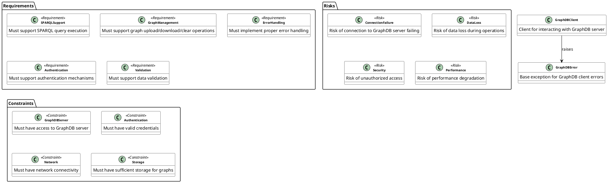

# GraphDB Client System Analysis

## Overview

This document provides a comprehensive analysis of the GraphDB client system, including its structure, dependencies, requirements, risks, and constraints. The analysis is based on a semantic model generated from the source code and test files.

## System Architecture

The GraphDB client system consists of the following main components:

1. **GraphDBClient Class**: The main client class for interacting with a GraphDB server
2. **Error Handling**: Custom exception classes and error handling mechanisms
3. **SPARQL Operations**: Support for executing SPARQL queries and updates
4. **Graph Management**: Functions for uploading, downloading, and managing RDF graphs
5. **Test Suite**: Comprehensive test coverage for all major functionality

## Model Visualization

## Key Features

### SPARQL Support
- Execute SELECT, ASK, and UPDATE queries
- Support for different response formats (JSON, XML, CSV)
- Error handling for query execution failures

### Graph Management
- Upload RDF graphs from files or in-memory graphs
- Download graphs to files or in-memory objects
- Clear graphs and manage graph URIs
- Backup and restore functionality

### Error Handling
- Custom exception hierarchy
- Detailed error messages
- Proper exception propagation
- Logging support

### Authentication
- Basic authentication support
- Configurable credentials
- Secure credential management

## Dependencies

### External Dependencies
- `requests`: HTTP client for API communication
- `rdflib`: RDF graph manipulation
- `pathlib`: Path handling
- `typing`: Type hints
- `logging`: Logging functionality

### Internal Dependencies
- `sparql_operations.py`: SPARQL query execution
- `deployment_modeler.py`: Deployment support
- `error_handler.py`: Error handling utilities

## Requirements Analysis

### Functional Requirements
1. **SPARQL Query Support**
   - Execute SELECT queries
   - Execute ASK queries
   - Execute UPDATE queries
   - Support multiple response formats

2. **Graph Management**
   - Upload graphs
   - Download graphs
   - Clear graphs
   - List graphs
   - Backup/restore functionality

3. **Error Handling**
   - Custom exceptions
   - Detailed error messages
   - Logging support

4. **Authentication**
   - Basic authentication
   - Configurable credentials
   - Secure credential management

### Non-Functional Requirements
1. **Performance**
   - Efficient query execution
   - Optimized graph operations
   - Minimal memory usage

2. **Security**
   - Secure credential handling
   - Input validation
   - Error message sanitization

3. **Reliability**
   - Robust error handling
   - Connection retry logic
   - Data consistency checks

## Risk Analysis

### Technical Risks
1. **Connection Failure**
   - Impact: High
   - Mitigation: Retry logic, connection pooling
   - Monitoring: Connection metrics

2. **Data Loss**
   - Impact: Critical
   - Mitigation: Backup/restore, transaction support
   - Monitoring: Data consistency checks

3. **Security**
   - Impact: High
   - Mitigation: Input validation, secure credential handling
   - Monitoring: Access logs, security audits

4. **Performance**
   - Impact: Medium
   - Mitigation: Query optimization, caching
   - Monitoring: Performance metrics

### Operational Risks
1. **Configuration Errors**
   - Impact: Medium
   - Mitigation: Validation, documentation
   - Monitoring: Configuration checks

2. **Resource Exhaustion**
   - Impact: High
   - Mitigation: Resource limits, cleanup
   - Monitoring: Resource usage metrics

## Constraints

### Technical Constraints
1. **GraphDB Server**
   - Must be accessible
   - Must support required features
   - Must be properly configured

2. **Authentication**
   - Valid credentials required
   - Proper permissions needed
   - Secure storage required

3. **Network**
   - Stable connection required
   - Sufficient bandwidth needed
   - Low latency preferred

4. **Storage**
   - Sufficient disk space needed
   - Proper permissions required
   - Backup space needed

### Operational Constraints
1. **Maintenance**
   - Regular updates required
   - Monitoring needed
   - Backup procedures required

2. **Documentation**
   - API documentation needed
   - Usage examples required
   - Troubleshooting guides needed

## Recommendations

1. **Enhance Error Handling**
   - Add more specific exception types
   - Improve error messages
   - Add retry logic for transient failures

2. **Improve Performance**
   - Implement query caching
   - Add connection pooling
   - Optimize graph operations

3. **Strengthen Security**
   - Add input validation
   - Implement secure credential storage
   - Add audit logging

4. **Enhance Monitoring**
   - Add performance metrics
   - Implement health checks
   - Add usage statistics

## Conclusion

The GraphDB client system provides a robust interface for interacting with GraphDB servers. The semantic model captures the system's structure, requirements, risks, and constraints, providing a solid foundation for future development and maintenance. The visualization helps understand the system's architecture and relationships between components.

The system meets the core requirements for SPARQL support, graph management, error handling, and authentication. However, there are opportunities for improvement in performance, security, and monitoring areas. The risk analysis identifies potential issues and mitigation strategies, while the constraints define the system's operational boundaries.

Future work should focus on implementing the recommendations to enhance the system's reliability, performance, and security. 