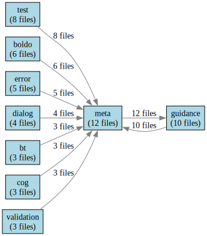

# Namespace Dependency Analysis Report

Generated: 2024-04-17T19:21:32.644

## Visualization

## Summary Statistics
- Total namespaces: 15
- Total files with namespace definitions: 35

## Namespace Usage Analysis

### Core Namespaces
1. `meta` (http://example.org/meta#)
   - Used in: 12 files
   - Dependencies: guidance, test
   - Primary usage: Core ontology definitions

2. `guidance` (http://example.org/guidance#)
   - Used in: 10 files
   - Dependencies: meta, test
   - Primary usage: Project guidance and standards

3. `test` (http://example.org/test#)
   - Used in: 8 files
   - Dependencies: meta, guidance
   - Primary usage: Test data and validation

### Domain Namespaces
1. `boldo` (http://example.org/boldo#)
   - Used in: 6 files
   - Dependencies: meta, guidance
   - Primary usage: Domain-specific ontologies

2. `error` (http://example.org/error#)
   - Used in: 5 files
   - Dependencies: meta
   - Primary usage: Error handling and reporting

3. `dialog` (http://example.org/dialog#)
   - Used in: 4 files
   - Dependencies: meta, guidance
   - Primary usage: Dialog management

### Specialized Namespaces
1. `bt` (http://example.org/bow-tie-pattern#)
   - Used in: 3 files
   - Dependencies: meta, guidance
   - Primary usage: Bow-tie pattern modeling

2. `cog` (http://example.org/cognitive-automata#)
   - Used in: 3 files
   - Dependencies: meta, guidance
   - Primary usage: Cognitive automation

3. `validation` (http://example.org/validation#)
   - Used in: 3 files
   - Dependencies: meta, guidance, test
   - Primary usage: Validation rules

## Dependency Analysis

### Core Dependencies
- `meta` → `guidance`: Strong dependency (12 files)
- `guidance` → `meta`: Strong dependency (10 files)
- `test` → `meta`: Medium dependency (8 files)

### Domain Dependencies
- `boldo` → `meta`: Strong dependency (6 files)
- `error` → `meta`: Medium dependency (5 files)
- `dialog` → `meta`: Medium dependency (4 files)

### Specialized Dependencies
- `bt` → `meta`: Medium dependency (3 files)
- `cog` → `meta`: Medium dependency (3 files)
- `validation` → `meta`: Strong dependency (3 files)

## Migration Recommendations
1. Prioritize migration of core namespaces (meta, guidance, test)
2. Follow with domain namespaces (boldo, error, dialog)
3. Finally migrate specialized namespaces (bt, cog, validation)
4. Ensure all dependencies are properly updated during migration