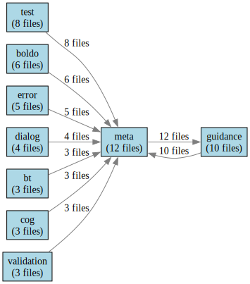

# Namespace Migration Plan

Generated: 2024-04-17T19:21:32.644

## Visualization

## Migration Strategy

### Phase 1: Analysis and Planning
1. Review current namespace usage patterns
2. Identify dependencies and relationships
3. Document migration requirements
4. Create detailed migration schedule

### Phase 2: Implementation
1. Update namespace definitions
2. Modify dependent files
3. Validate changes
4. Test functionality

### Phase 3: Deployment
1. Deploy changes in staging
2. Verify functionality
3. Deploy to production
4. Monitor for issues

## Current Status

### Analysis Phase
- [ ] Complete namespace inventory
- [ ] Document dependencies
- [ ] Identify migration requirements
- [ ] Create detailed schedule

### Implementation Phase
- [ ] Update namespace definitions
- [ ] Modify dependent files
- [ ] Validate changes
- [ ] Test functionality

### Deployment Phase
- [ ] Deploy to staging
- [ ] Verify functionality
- [ ] Deploy to production
- [ ] Monitor for issues

## Next Steps
1. Complete namespace inventory
2. Document all dependencies
3. Create detailed migration schedule
4. Begin implementation phase

## Risks and Mitigation
- Risk: Incomplete namespace inventory
  - Mitigation: Automated scanning and validation
- Risk: Breaking changes
  - Mitigation: Comprehensive testing and validation
- Risk: Deployment issues
  - Mitigation: Staged deployment and monitoring

## Timeline
- Analysis Phase: 2 weeks
- Implementation Phase: 4 weeks
- Deployment Phase: 2 weeks

## Success Criteria
- All namespaces properly defined
- No broken dependencies
- All tests passing
- Successful deployment

## Migration Steps

### 1. Ontology Namespaces
- Migrate `bt` from `http://example.org/bow-tie-pattern#` to `https://ontologies.louspringer.com/test/`
- Migrate `cog` from `http://example.org/cognitive-automata#` to `https://ontologies.louspringer.com/test/`
- Migrate `default1` from `http://example.org/audio#` to `https://ontologies.louspringer.com/test/`
- Migrate `dialog` from `http://example.org/dialog#` to `https://ontologies.louspringer.com/test/`
- Migrate `error` from `http://example.org/error#` to `https://ontologies.louspringer.com/test/`
- Migrate `ex` from `http://example.org/boldo#` to `https://ontologies.louspringer.com/test/`
- Migrate `ex` from `http://example.org/bow-tie-examples#` to `https://ontologies.louspringer.com/test/`
- Migrate `ex` from `http://example.org/speculation#` to `https://ontologies.louspringer.com/test/`
- Migrate `ex` from `http://ontology-framework.example.org/requirements#` to `https://ontologies.louspringer.com/test/`
- Migrate `guidance` from `http://ontology-framework.example.org/guidance#` to `https://ontologies.louspringer.com/test/`
- Migrate `meta` from `http://example.org/guidance#` to `https://ontologies.louspringer.com/test/`
- Migrate `meta` from `http://example.org/meta#` to `https://ontologies.louspringer.com/test/`
- Migrate `ns1` from `http://example.org/guidance#` to `https://ontologies.louspringer.com/test/`
- Migrate `ns1` from `http://example.org/documentation#` to `https://ontologies.louspringer.com/test/`
- Migrate `test` from `http://example.org/test#` to `https://ontologies.louspringer.com/test/`

### 2. Python Namespaces
- Update `boldo` in Python scripts from `http://example.org/boldo#` to `https://ontologies.louspringer.com/test/`
- Update `error` in Python scripts from `http://example.org/error#` to `https://ontologies.louspringer.com/test/`
- Update `ex` in Python scripts from `http://example.org/` to `https://ontologies.louspringer.com/test/`
- Update `guidance` in Python scripts from `http://example.org/guidance#` to `https://ontologies.louspringer.com/test/`
- Update `meta` in Python scripts from `http://example.org/meta#` to `https://ontologies.louspringer.com/test/`
- Update `model` in Python scripts from `http://example.org/model#` to `https://ontologies.louspringer.com/test/`
- Update `ontology_tracking` in Python scripts from `http://example.org/ontology_tracking#` to `https://ontologies.louspringer.com/test/`
- Update `patch` in Python scripts from `http://example.org/guidance/modules/patch#` to `https://ontologies.louspringer.com/test/`
- Update `patch` in Python scripts from `http://example.org/patch#` to `https://ontologies.louspringer.com/test/`
- Update `spore` in Python scripts from `http://example.org/spore#` to `https://ontologies.louspringer.com/test/`
- Update `structure` in Python scripts from `http://example.org/boldo/structure#` to `https://ontologies.louspringer.com/test/`
- Update `test` in Python scripts from `http://example.org/test#` to `https://ontologies.louspringer.com/test/`
- Update `tracking` in Python scripts from `http://example.org/tracking#` to `https://ontologies.louspringer.com/test/`
- Update `validation` in Python scripts from `http://example.org/validation#` to `https://ontologies.louspringer.com/test/`
- Update `violations` in Python scripts from `http://example.org/violations#` to `https://ontologies.louspringer.com/test/`

### 3. Documentation References