# Namespace Recovery Plan

## Related Files
- Model: [Recovery Plan Model](../models/recovery_plan.md)
- Implementation: [Namespace Recovery](../src/ontology_framework/namespace_recovery.py)
- Tests: [Namespace Recovery Tests](../tests/test_namespace_recovery.py)
- Standards: [Namespace Standards](../docs/namespace_standards.md)
- Validation: [Validation Procedures](../docs/validation_procedures.md)

## Current Status

| Property | Value |
|----------|-------|
| Current Phase | Analysis |
| Progress | 50% |
| Last Update | 2024-04-17 15:00:00 UTC |
| Next Milestone | Complete namespace validation implementation |
| Status Description | Tasks ANAL-001 and ANAL-005 in progress, 8 tasks completed including CLI tool delivery and pre-commit hook optimization |

## Analysis Phase Backlog

| Task ID | Description | Priority | Status | Owner | Est. Hours | Completion Criteria | Resource Allocation | Dependencies | Associated Risks |
|---------|-------------|----------|--------|-------|------------|---------------------|---------------------|--------------|------------------|
| ANAL-001 | Inventory all files using example.org | HIGH | IN_PROGRESS | Ontology Team | 16 | Complete list of all files using example.org with line numbers and context | 2 team members, 2 days | None | R1 |
| ANAL-002 | Map namespace dependencies | HIGH | TODO | Ontology Team | 24 | Dependency graph showing all namespace relationships | 2 team members, 3 days | ANAL-001 | R2 |
| ANAL-003 | Identify validation requirements | HIGH | COMPLETED | Testing Team | 16 | List of validation rules and test cases | 1 team member, 2 days | ANAL-001 | R1 |
| ANAL-004 | Document current namespace patterns | MEDIUM | TODO | Documentation Team | 8 | Documentation of all namespace patterns | 1 team member, 1 day | ANAL-002 | None |
| ANAL-005 | Assess impact on CI/CD pipeline | HIGH | IN_PROGRESS | DevOps Team | 12 | Impact assessment report | 1 team member, 1.5 days | ANAL-001 | R1 |
| ANAL-006 | Review security implications | HIGH | COMPLETED | Security Team | 16 | Security assessment report | 1 team member, 2 days | ANAL-001 | R1 |
| ANAL-007 | Create test scenarios | MEDIUM | COMPLETED | Testing Team | 16 | Test scenarios document | 1 team member, 2 days | ANAL-003 | None |
| ANAL-008 | Define rollback procedures | HIGH | IN_PROGRESS | Operations Team | 12 | Rollback procedures document | 1 team member, 1.5 days | ANAL-005 | R2 |
| ANAL-009 | Estimate resource requirements | MEDIUM | COMPLETED | Project Manager | 8 | Resource requirements document | 1 team member, 1 day | ANAL-001, ANAL-002, ANAL-003 | None |
| ANAL-010 | Draft communication plan | MEDIUM | COMPLETED | Project Manager | 8 | Communication plan document | 1 team member, 1 day | ANAL-009 | None |
| ANAL-011 | Implement error logging | HIGH | COMPLETED | Development Team | 8 | Error logging system implemented | 1 team member, 1 day | ANAL-003 | None |
| ANAL-012 | Add test coverage requirements | HIGH | COMPLETED | Testing Team | 8 | Test coverage requirements documented | 1 team member, 1 day | ANAL-007 | None |
| ANAL-013 | Establish file organization standards | HIGH | COMPLETED | Documentation Team | 8 | File organization standards documented | 1 team member, 1 day | ANAL-004 | None |
| ANAL-014 | Implement cross-referencing standards | HIGH | COMPLETED | Documentation Team | 8 | Cross-referencing standards documented | 1 team member, 1 day | ANAL-004 | None |
| ANAL-015 | Synchronize model with guidance.ttl | HIGH | COMPLETED | Ontology Team | 8 | Model synchronized with guidance requirements | 1 team member, 1 day | ANAL-003 | None |
| ANAL-016 | Develop and deliver CLI tool | HIGH | COMPLETED | Development Team | 24 | CLI tool implemented with all required functionality | 2 team members, 3 days | ANAL-003, ANAL-007 | R1 |
| ANAL-017 | Optimize pre-commit hook | HIGH | COMPLETED | Development Team | 4 | Pre-commit hook optimized for performance and maintainability | 1 team member, 0.5 days | ANAL-003 | None |

### Risk Key
- R1: Validation failures during namespace changes
- R2: System instability during namespace updates

## Requirements

| ID | Description | Priority |
|----|-------------|----------|
| REQ-001 | Restore all relative paths in production code | HIGH |
| REQ-002 | Implement namespace validation in CI/CD | HIGH |
| REQ-003 | Document namespace standards | MEDIUM |

## Validation Criteria

| Metric | Success Threshold |
|--------|-------------------|
| Percentage of files with correct namespace | 100% |
| Number of validation failures | 0 |

## Resource Requirements

| Type | Description |
|------|-------------|
| Team | Ontology development team |
| Tool | SPARQL validation tools |

## Communication Plan

| Stakeholder | Frequency |
|-------------|-----------|
| Development Team | Daily |
| Project Stakeholders | Weekly |

## Testing Strategy

| Test Type | Environment |
|-----------|------------|
| Unit Test | Development |
| Integration Test | Staging |

## Rollback Procedures

| Trigger Condition | Rollback Steps |
|------------------|----------------|
| Validation failure | Restore previous namespace configuration |
| System instability | Revert to last stable version |

## Dependencies

| Type | Description |
|------|-------------|
| External | SPARQL engine availability |
| Internal | CI/CD pipeline access |

## Timeline

| Phase | Start Date | End Date |
|-------|------------|----------|
| Phase 1: Analysis | 2024-03-20 | 2024-03-27 |
| Phase 2: Implementation | 2024-03-28 | 2024-04-10 |

## Security Considerations

| Impact | Control |
|--------|---------|
| Access control | Role-based access for namespace changes |
| Audit trail | Log all namespace modifications |

## Risks

| ID | Description | Severity | Mitigation |
|----|-------------|----------|------------|
| RISK-001 | Breaking changes in production code | HIGH | Implement comprehensive testing before deployment |
| RISK-002 | Incomplete namespace restoration | MEDIUM | Automated validation and manual review |

## Constraints

| ID | Description |
|----|-------------|
| CONST-001 | Must maintain backward compatibility |
| CONST-002 | Must follow project ontology standards |

## Assumptions

| ID | Description |
|----|-------------|
| ASSUMP-001 | All namespace changes can be tracked |
| ASSUMP-002 | CI/CD pipeline can be modified |

## Static Structure Diagram

```mermaid
classDiagram
    class NamespaceRecoveryPlan {
        +String label
        +String comment
    }
    class CurrentState {
        +Boolean hasExampleOrgUsage
        +Boolean hasRelativePathUsage
    }
    class RecoveryStep {
        +Integer stepOrder
        +String stepDescription
    }
    class Requirement {
        +String requirementID
        +String description
        +String priority
    }
    class Risk {
        +String riskID
        +String description
        +String severity
        +String mitigation
    }
    class Constraint {
        +String constraintID
        +String description
    }
    class Assumption {
        +String assumptionID
        +String description
    }
    class LifecycleConcern {
        +String phase
        +String description
    }
    class DeploymentModel {
        +String type
        +String description
    }
    class ChangeLog {
        +String changeID
        +DateTime changeDate
        +String description
    }
    class Solution {
        +String description
    }
    class ValidationCriteria {
        +String metric
        +String threshold
    }
    class ResourceRequirement {
        +String type
        +String description
    }
    class CommunicationPlan {
        +String stakeholder
        +String frequency
    }
    class TestingStrategy {
        +String testType
        +String environment
    }
    class RollbackProcedure {
        +String trigger
        +String steps
    }
    class Dependency {
        +String type
        +String description
    }
    class Timeline {
        +String phase
        +Date startDate
        +Date endDate
    }
    class SecurityConsideration {
        +String impact
        +String control
    }

    NamespaceRecoveryPlan --> CurrentState
    NamespaceRecoveryPlan --> RecoveryStep
    NamespaceRecoveryPlan --> Requirement
    NamespaceRecoveryPlan --> Risk
    NamespaceRecoveryPlan --> Constraint
    NamespaceRecoveryPlan --> Assumption
    NamespaceRecoveryPlan --> LifecycleConcern
    NamespaceRecoveryPlan --> DeploymentModel
    NamespaceRecoveryPlan --> ChangeLog
    NamespaceRecoveryPlan --> Solution
    NamespaceRecoveryPlan --> ValidationCriteria
    NamespaceRecoveryPlan --> ResourceRequirement
    NamespaceRecoveryPlan --> CommunicationPlan
    NamespaceRecoveryPlan --> TestingStrategy
    NamespaceRecoveryPlan --> RollbackProcedure
    NamespaceRecoveryPlan --> Dependency
    NamespaceRecoveryPlan --> Timeline
    NamespaceRecoveryPlan --> SecurityConsideration
```

## Deployment Diagram

## Change Log

| ID | Date | Description |
|----|------|-------------|
| CHG-001 | 2024-03-20 | Initial recovery plan created |
| CHG-002 | 2024-04-17 | Added References section and cross-references |
| CHG-003 | 2024-04-17 | Added GitHub project links and updated documentation |
| CHG-004 | 2024-04-17 | Added GitHub issue tracking and documentation links |
| CHG-005 | 2024-04-17 | Added planned CI/CD integration details |
| CHG-006 | 2024-04-17 | Synchronized with guidance.ttl requirements |
| CHG-007 | 2024-04-17 | Added CLI tool delivery to backlog |
| CHG-008 | 2024-04-17 | Added pre-commit hook optimization to backlog |

## References

### Project Implementation
- [Namespace Recovery Project Implementation](../src/ontology_framework/namespace_recovery.py)
- [GitHub Project Manager Implementation](../src/ontology_framework/github_project_manager.py)
- [Namespace Recovery Project Tests](../tests/test_namespace_recovery.py)
- [GitHub Repository](https://github.com/louspringer/ontology-framework)
- [Project Board](https://github.com/louspringer/ontology-framework/projects/1)
- [Tracking Issue](https://github.com/louspringer/ontology-framework/issues/1)
- [Initial PR](https://github.com/louspringer/ontology-framework/pull/1)
- [Pre-commit Hook Template](../scripts/pre-commit.template)

### Standards & Documentation
- [Turtle RDF Language Specification](https://www.w3.org/TR/turtle/)
- [RDF 1.1 Concepts](https://www.w3.org/TR/rdf11-concepts/)
- [SHACL Validation Language](https://www.w3.org/TR/shacl/)
- [N-ary Relations Best Practices](https://www.w3.org/TR/swbp-n-aryRelations/)

### Project Resources
- [Project Ontology Guidance](file:///guidance.ttl)
- [Namespace Standards Documentation](file:///docs/namespace_standards.md)
- [Validation Procedures Documentation](file:///docs/validation_procedures.md)
- [Rollback Procedures Documentation](file:///docs/rollback_procedures.md)
- [Security Guidelines Documentation](file:///docs/security_guidelines.md) 