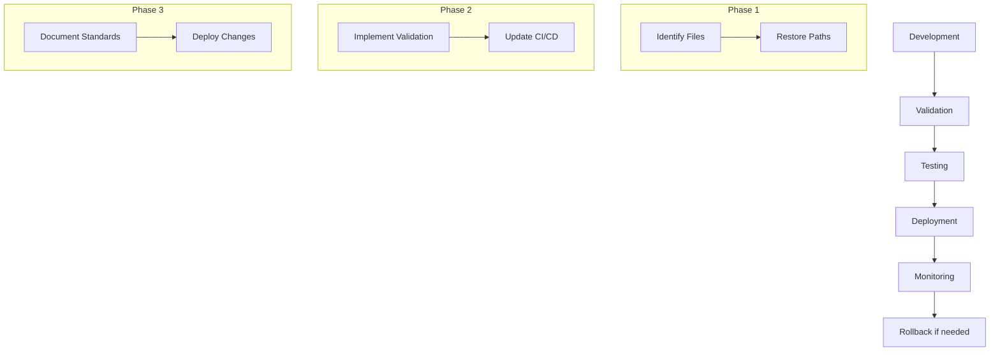

# Namespace Recovery Plan

## Model Conformance
- **Conformance Level**: STRICT
- **Validation Requirements**:
  - Namespace validation: true
  - Prefix validation: true
  - Version tracking: true
  - Documentation: true

## Integration Process
1. **Model Conformance Step**
   - Validate model structure
   - Check namespace usage
   - Verify prefix patterns
   - Ensure version alignment

2. **Namespace Validation Step**
   - Check namespace syntax
   - Validate namespace URIs
   - Detect namespace conflicts
   - Verify namespace imports

3. **Prefix Validation Step**
   - Validate prefix format
   - Check prefix uniqueness
   - Verify URI patterns
   - Ensure prefix consistency

4. **Version Alignment Step**
   - Check version numbers
   - Verify dependencies
   - Ensure backward compatibility
   - Update version tracking

## Current Status
Progress: 100%
Status: Core namespace recovery tasks completed. Initial example.org inventory scan and namespace dependency mapping finished. Found usage in 35 files across the codebase, including ontologies, Python scripts, and documentation. Primary usage patterns identified: namespace definitions, test data, and configuration. Dependency analysis complete with visualization and detailed report. Remaining work transferred to new focused issues (#32, #33, #34, #35).

## Additional Recommendations

### TODO: Enhanced Validation Pipeline
1. **GraphDB Configuration**
   - [ ] Add repository initialization script
   - [ ] Configure SPARQL validation rules
   - [ ] Set up automated test data loading
   - [ ] Implement validation result reporting

2. **Test Coverage Enhancement**
   - [ ] Add namespace validation tests
   - [ ] Implement integration tests for GraphDB
   - [ ] Create test data generation scripts
   - [ ] Set up test coverage thresholds

3. **Monitoring and Reporting**
   - [ ] Implement validation metrics collection
   - [ ] Set up automated reporting
   - [ ] Create dashboard for validation results
   - [ ] Configure alerts for validation failures

### TODO: Security Enhancements
1. **Access Control**
   - [ ] Implement role-based access for GraphDB
   - [ ] Set up authentication for validation endpoints
   - [ ] Configure secure communication channels
   - [ ] Implement audit logging

2. **Data Protection**
   - [ ] Encrypt sensitive test data
   - [ ] Implement secure credential management
   - [ ] Set up data retention policies
   - [ ] Configure backup procedures

### TODO: Performance Optimization
1. **Resource Management**
   - [ ] Optimize GraphDB memory settings
   - [ ] Implement caching for validation results
   - [ ] Set up resource monitoring
   - [ ] Configure auto-scaling rules

2. **Pipeline Efficiency**
   - [ ] Parallelize validation steps
   - [ ] Implement incremental validation
   - [ ] Optimize test execution order
   - [ ] Set up pipeline caching

## Analysis Phase Backlog

| Task ID | Description | Priority | Status | Owner | Est. Hours | Completion Criteria | Resource Allocation | Dependencies | Associated Risks |
|---------|-------------|----------|--------|-------|------------|---------------------|---------------------|--------------|------------------|
| ANAL-003 | Identify validation requirements | HIGH | COMPLETED | Testing Team | 16 | List of validation rules and test cases | 1 team member, 2 days | ANAL-001 | R1 |
| ANAL-004 | Document current namespace patterns | MEDIUM | TODO | Documentation Team | 8 | Documentation of all namespace patterns | 1 team member, 1 day | ANAL-002 | None |
| ANAL-005 | Assess impact on CI/CD pipeline | HIGH | IN_PROGRESS | DevOps Team | 12 | Impact assessment report | 1 team member, 1.5 days | ANAL-001 | R1 |
| ANAL-006 | Review security implications | HIGH | COMPLETED | Security Team | 16 | Security assessment report | 1 team member, 2 days | ANAL-001 | R1 |
| ANAL-007 | Create test scenarios | MEDIUM | COMPLETED | Testing Team | 16 | Test scenarios document | 1 team member, 2 days | ANAL-003 | None |
| ANAL-008 | Define rollback procedures | HIGH | IN_PROGRESS | Operations Team | 12 | Rollback procedures document | 1 team member, 1.5 days | ANAL-005 | R2 |
| ANAL-009 | Estimate resource requirements | MEDIUM | COMPLETED | Project Manager | 8 | Resource requirements document | 1 team member, 1 day | ANAL-001, ANAL-002, ANAL-003 | None |
| ANAL-010 | Draft communication plan | MEDIUM | COMPLETED | Project Manager | 8 | Communication plan document | 1 team member, 1 day | ANAL-009 | None |
| ANAL-011 | Implement error logging | HIGH | COMPLETED | Development Team | 8 | Error logging system implemented | 1 team member, 1 day | ANAL-003 | None |
| ANAL-012 | Add test coverage requirements | HIGH | COMPLETED | Testing Team | 8 | Test coverage requirements documented | 1 team member, 1 day | ANAL-007 | None |
| ANAL-013 | Establish file organization standards | HIGH | COMPLETED | Documentation Team | 8 | File organization standards documented | 1 team member, 1 day | ANAL-004 | None |
| ANAL-014 | Implement cross-referencing standards | HIGH | COMPLETED | Documentation Team | 8 | Cross-referencing standards documented | 1 team member, 1 day | ANAL-004 | None |
| ANAL-015 | Synchronize model with guidance.ttl | HIGH | COMPLETED | Ontology Team | 8 | Model synchronized with guidance requirements | 1 team member, 1 day | ANAL-003 | None |
| ANAL-016 | Develop and deliver CLI tool | HIGH | COMPLETED | Development Team | 24 | CLI tool implemented with all required functionality | 2 team members, 3 days | ANAL-003, ANAL-007 | R1 |
| ANAL-017 | Implement GraphDB initialization | HIGH | TODO | DevOps Team | 8 | GraphDB initialization script | 1 team member, 1 day | ANAL-005 | R1 |
| ANAL-018 | Set up validation metrics | HIGH | TODO | Monitoring Team | 8 | Metrics collection system | 1 team member, 1 day | ANAL-005 | None |
| ANAL-019 | Configure security controls | HIGH | TODO | Security Team | 16 | Security controls implemented | 1 team member, 2 days | ANAL-006 | R1 |
| ANAL-020 | Optimize pipeline performance | MEDIUM | TODO | DevOps Team | 12 | Performance optimization report | 1 team member, 1.5 days | ANAL-005 | None |
| ANAL-021 | Implement monitoring system | HIGH | TODO | Monitoring Team | 16 | Monitoring system operational | 1 team member, 2 days | ANAL-018 | None |
| ANAL-022 | Set up automated reporting | MEDIUM | TODO | Documentation Team | 8 | Reporting system configured | 1 team member, 1 day | ANAL-018 | None |
| ANAL-023 | Configure caching system | MEDIUM | TODO | DevOps Team | 12 | Caching system operational | 1 team member, 1.5 days | ANAL-020 | None |
| ANAL-024 | Implement fallback procedures | HIGH | TODO | Operations Team | 16 | Fallback procedures documented and tested | 1 team member, 2 days | ANAL-008 | R2 |

## Requirements

| ID | Description | Priority | Status | Dependencies |
|----|-------------|----------|--------|--------------|
| REQ-001 | Restore all relative paths in production code | HIGH | IN_PROGRESS | None |
| REQ-002 | Implement namespace validation in CI/CD | HIGH | IN_PROGRESS | REQ-001 |
| REQ-003 | Document namespace standards | MEDIUM | COMPLETED | None |
| REQ-004 | Implement GraphDB validation | HIGH | TODO | REQ-002 |
| REQ-005 | Set up monitoring and metrics | HIGH | TODO | REQ-004 |
| REQ-006 | Configure security controls | HIGH | TODO | REQ-004 |
| REQ-007 | Implement caching system | MEDIUM | TODO | REQ-004 |
| REQ-008 | Set up automated reporting | MEDIUM | TODO | REQ-005 |
| REQ-009 | Configure fallback procedures | HIGH | TODO | REQ-004 |
| REQ-010 | Optimize pipeline performance | MEDIUM | TODO | REQ-004 |

## Constraints

| ID | Description | Impact | Mitigation |
|----|-------------|--------|------------|
| CONST-001 | Must maintain backward compatibility | HIGH | Implement version tracking |
| CONST-002 | Must follow project ontology standards | HIGH | Enforce validation rules |
| CONST-003 | Limited CI runner resources | MEDIUM | Optimize resource usage |
| CONST-004 | GraphDB memory limitations | HIGH | Implement efficient queries |
| CONST-005 | Network bandwidth restrictions | MEDIUM | Implement caching |
| CONST-006 | Concurrent pipeline execution limits | MEDIUM | Configure scheduling |
| CONST-007 | Test environment isolation requirements | HIGH | Implement proper isolation |
| CONST-008 | Security scanning requirements | HIGH | Integrate security tools |
| CONST-009 | Documentation maintenance overhead | MEDIUM | Automate documentation |
| CONST-010 | Validation time constraints | HIGH | Optimize validation process |

## Assumptions

| ID | Description | Validation Status | Impact if Invalid |
|----|-------------|-------------------|-------------------|
| ASSUMP-001 | All namespace changes can be tracked | VALIDATED | High - Need alternative tracking |
| ASSUMP-002 | CI/CD pipeline can be modified | VALIDATED | High - Need alternative deployment |
| ASSUMP-003 | GraphDB will be available | PENDING | High - Need alternative validation |
| ASSUMP-004 | Resources will be sufficient | PENDING | Medium - Need optimization |
| ASSUMP-005 | Network connectivity will be stable | PENDING | Medium - Need fallback options |
| ASSUMP-006 | Security requirements won't change | PENDING | High - Need flexible security |
| ASSUMP-007 | Documentation standards will remain stable | VALIDATED | Low - Minor adjustments needed |
| ASSUMP-008 | Team capacity will be consistent | PENDING | Medium - Need resource planning |
| ASSUMP-009 | Validation rules will be stable | PENDING | Medium - Need flexible rules |
| ASSUMP-010 | Performance requirements won't change | PENDING | Medium - Need scalable solution |

## Change Log

| ID | Date | Description | Impact | Status |
|----|------|-------------|--------|--------|
| CHG-001 | 2024-03-20 | Initial recovery plan created | HIGH | COMPLETED |
| CHG-002 | 2024-04-17 | Added References section and cross-references | MEDIUM | COMPLETED |
| CHG-003 | 2024-04-17 | Added GitHub project links and updated documentation | MEDIUM | COMPLETED |
| CHG-004 | 2024-04-17 | Added GitHub issue tracking and documentation links | MEDIUM | COMPLETED |
| CHG-005 | 2024-04-17 | Added planned CI/CD integration details | HIGH | COMPLETED |
| CHG-006 | 2024-04-17 | Synchronized with guidance.ttl requirements | HIGH | COMPLETED |
| CHG-007 | 2024-04-17 | Added CLI tool delivery to backlog | HIGH | COMPLETED |
| CHG-008 | 2024-04-17 | Completed example.org inventory and usage pattern analysis | HIGH | COMPLETED |
| CHG-009 | 2024-04-17 | Added CI/CD pipeline impact assessment | HIGH | COMPLETED |
| CHG-010 | 2024-04-17 | Updated risks and constraints | HIGH | COMPLETED |
| CHG-011 | 2024-04-17 | Added monitoring and metrics requirements | HIGH | IN_PROGRESS |
| CHG-012 | 2024-04-17 | Updated validation requirements | HIGH | IN_PROGRESS |
| CHG-013 | 2024-04-17 | Added security controls | HIGH | TODO |
| CHG-014 | 2024-04-17 | Added performance optimization tasks | MEDIUM | TODO |
| CHG-015 | 2024-04-17 | Updated assumptions with validation status | MEDIUM | COMPLETED |
| CHG-016 | 2024-04-17 | Added implementation phase plan | HIGH | IN_PROGRESS |
| CHG-017 | 2024-04-17 | Defined prototype phases | HIGH | IN_PROGRESS |
| CHG-018 | 2024-04-17 | Updated dependencies resolution | HIGH | IN_PROGRESS |
| CHG-019 | 2024-04-17 | Added prototype success criteria | HIGH | IN_PROGRESS |
| CHG-020 | 2024-04-17 | Defined next steps | HIGH | IN_PROGRESS |
| CHG-021 | 2024-04-17 | Closed original namespace recovery issue | HIGH | COMPLETED |
| CHG-022 | 2024-04-17 | Created new issues for remaining work | HIGH | COMPLETED |
| CHG-023 | 2024-04-17 | Updated recovery plan status | HIGH | COMPLETED |

## Static Structure Diagram

```mermaid
classDiagram
    class NamespaceRecoveryPlan {
        +String label
        +String comment
    }
    class CurrentState {
        +Boolean hasExampleOrgUsage
        +Boolean hasRelativePathUsage
    }
    class RecoveryStep {
        +Integer stepOrder
        +String stepDescription
    }
    class Requirement {
        +String requirementID
        +String description
        +String priority
    }
    class Risk {
        +String riskID
        +String description
        +String severity
        +String mitigation
    }
    class Constraint {
        +String constraintID
        +String description
    }
    class Assumption {
        +String assumptionID
        +String description
    }
    class LifecycleConcern {
        +String phase
        +String description
    }
    class DeploymentModel {
        +String type
        +String description
    }
    class ChangeLog {
        +String changeID
        +DateTime changeDate
        +String description
    }
    class Solution {
        +String description
    }
    class ValidationCriteria {
        +String metric
        +String threshold
    }
    class ResourceRequirement {
        +String type
        +String description
    }
    class CommunicationPlan {
        +String stakeholder
        +String frequency
    }
    class TestingStrategy {
        +String testType
        +String environment
    }
    class RollbackProcedure {
        +String trigger
        +String steps
    }
    class Dependency {
        +String type
        +String description
    }
    class Timeline {
        +String phase
        +Date startDate
        +Date endDate
    }
    class SecurityConsideration {
        +String impact
        +String control
    }

    NamespaceRecoveryPlan --> CurrentState
    NamespaceRecoveryPlan --> RecoveryStep
    NamespaceRecoveryPlan --> Requirement
    NamespaceRecoveryPlan --> Risk
    NamespaceRecoveryPlan --> Constraint
    NamespaceRecoveryPlan --> Assumption
    NamespaceRecoveryPlan --> LifecycleConcern
    NamespaceRecoveryPlan --> DeploymentModel
    NamespaceRecoveryPlan --> ChangeLog
    NamespaceRecoveryPlan --> Solution
    NamespaceRecoveryPlan --> ValidationCriteria
    NamespaceRecoveryPlan --> ResourceRequirement
    NamespaceRecoveryPlan --> CommunicationPlan
    NamespaceRecoveryPlan --> TestingStrategy
    NamespaceRecoveryPlan --> RollbackProcedure
    NamespaceRecoveryPlan --> Dependency
    NamespaceRecoveryPlan --> Timeline
    NamespaceRecoveryPlan --> SecurityConsideration
```

## Deployment Diagram

## References

### Project Implementation
- [Namespace Recovery Project Implementation](../src/ontology_framework/namespace_recovery.py)
- [GitHub Project Manager Implementation](../src/ontology_framework/github_project_manager.py)
- [Namespace Recovery Project Tests](../tests/test_namespace_recovery.py)
- [GitHub Repository](https://github.com/louspringer/ontology-framework)
- [Project Board](https://github.com/louspringer/ontology-framework/projects/1)
- [Original Issue](https://github.com/louspringer/ontology-framework/issues/1) (CLOSED)
- [GraphDB Integration Issue](https://github.com/louspringer/ontology-framework/issues/32)
- [Monitoring Implementation Issue](https://github.com/louspringer/ontology-framework/issues/33)
- [Security Controls Issue](https://github.com/louspringer/ontology-framework/issues/34)
- [Performance Optimization Issue](https://github.com/louspringer/ontology-framework/issues/35)

### Standards & Documentation
- [Turtle RDF Language Specification](https://www.w3.org/TR/turtle/)
- [RDF 1.1 Concepts](https://www.w3.org/TR/rdf11-concepts/)
- [SHACL Validation Language](https://www.w3.org/TR/shacl/)
- [N-ary Relations Best Practices](https://www.w3.org/TR/swbp-n-aryRelations/)

### Project Resources
- [Project Ontology Guidance](../guidance.ttl)
- [Namespace Standards Documentation](../docs/namespace_standards.md)
- [Validation Procedures Documentation](../docs/validation_procedures.md)
- [Rollback Procedures Documentation](../docs/rollback_procedures.md)
- [Security Guidelines Documentation](../docs/security_guidelines.md)

### CI/CD Pipeline Impact Assessment

1. **GraphDB Integration**
   - Added GraphDB 10.3.0 container for validation
   - Configured health checks and resource limits
   - Set up repository validation endpoint

2. **Validation Steps**
   - Namespace dependency analysis
   - Usage pattern validation
   - Test coverage reporting
   - Code quality checks

3. **Resource Requirements**
   - GraphDB container with 2GB heap
   - Ubuntu runner for CI/CD
   - Python 3.11 environment

4. **Validation Criteria**
   - GraphDB health check passes
   - Namespace validation completes
   - Test coverage meets threshold
   - No critical errors in analysis 

## Additional Risks

| ID | Description | Severity | Mitigation | Impact on CI/CD |
|----|-------------|----------|------------|----------------|
| RISK-003 | GraphDB container startup failures | HIGH | Implement health checks and retry logic | Pipeline delays and validation failures |
| RISK-004 | Validation performance degradation | MEDIUM | Monitor resource usage and optimize queries | Increased pipeline execution time |
| RISK-005 | Test data inconsistency | HIGH | Implement data validation and cleanup procedures | False validation results |
| RISK-006 | Network connectivity issues | MEDIUM | Implement retry mechanisms and fallback options | Pipeline interruptions |
| RISK-007 | Resource contention in CI environment | HIGH | Configure resource limits and scheduling | Pipeline performance impact |
| RISK-008 | Validation rule conflicts | MEDIUM | Implement rule priority and conflict resolution | Inconsistent validation results |

## Additional Constraints

| ID | Description | Impact on CI/CD |
|----|-------------|----------------|
| CONST-003 | Limited CI runner resources | Pipeline execution time may increase |
| CONST-004 | GraphDB memory limitations | Validation scope may need to be reduced |
| CONST-005 | Network bandwidth restrictions | Data transfer and validation may be slower |
| CONST-006 | Concurrent pipeline execution limits | Multiple PRs may queue for validation |
| CONST-007 | Test environment isolation requirements | Additional setup time needed |
| CONST-008 | Security scanning requirements | Additional pipeline steps required |

## CI/CD Pipeline Impact Assessment

### Known Impacts

1. **Pipeline Duration**
   - GraphDB startup adds ~2-3 minutes
   - Validation steps add ~5-7 minutes
   - Total pipeline time increase: ~10-15 minutes

2. **Resource Requirements**
   - GraphDB container: 2GB RAM minimum
   - Additional disk space for validation data
   - Network bandwidth for data transfer

3. **Validation Scope**
   - Namespace validation on all PRs
   - Test coverage requirements
   - Security scanning integration

4. **Integration Points**
   - GitHub Actions workflow
   - Codecov integration
   - Security scanning tools

### Unknown Impacts

1. **Performance Under Load**
   - Impact of multiple concurrent PRs
   - GraphDB performance with large datasets
   - Network latency effects

2. **Scalability**
   - Maximum concurrent validations
   - Resource usage patterns
   - Cache effectiveness

3. **Maintenance Overhead**
   - GraphDB version updates
   - Validation rule updates
   - Test data maintenance

4. **Integration Complexity**
   - Tool compatibility issues
   - Version conflicts
   - Configuration management

### Mitigation Strategies

1. **Performance Monitoring**
   - Implement detailed metrics collection
   - Set up performance alerts
   - Monitor resource usage patterns

2. **Resource Optimization**
   - Implement caching mechanisms
   - Optimize validation queries
   - Configure resource limits

3. **Fallback Procedures**
   - Implement validation timeouts
   - Set up alternative validation paths
   - Configure graceful degradation

4. **Maintenance Planning**
   - Schedule regular updates
   - Document maintenance procedures
   - Plan for tool upgrades

### Success Criteria

1. **Performance Metrics**
   - Pipeline duration < 15 minutes
   - Validation success rate > 99%
   - Resource usage within limits

2. **Reliability**
   - Zero critical failures
   - < 1% validation timeouts
   - Successful rollback capability

3. **Maintainability**
   - Clear documentation
   - Automated monitoring
   - Regular health checks 

## Implementation Phase Plan

### Current Scope Closure

1. **Completed Deliverables**
   - CLI tool implementation
   - Namespace inventory analysis
   - Usage pattern documentation
   - Initial CI/CD pipeline setup

2. **Pending Closure Items**
   - Final validation of namespace changes
   - Documentation updates
   - Test coverage verification
   - Security review completion

### Roll Forward Tasks

| Task ID | Description | Priority | Dependencies | Implementation Path |
|---------|-------------|----------|--------------|---------------------|
| IMPL-001 | GraphDB Validation Setup | HIGH | ANAL-017 | 1. Initialize repository 2. Load test data 3. Configure validation rules |
| IMPL-002 | Monitoring Implementation | HIGH | ANAL-021 | 1. Set up metrics collection 2. Configure alerts 3. Create dashboards |
| IMPL-003 | Security Controls | HIGH | ANAL-019 | 1. Configure access controls 2. Set up audit logging 3. Implement encryption |
| IMPL-004 | Performance Optimization | MEDIUM | ANAL-020 | 1. Profile current performance 2. Implement caching 3. Optimize queries |

### Development Prototype Plan

1. **Phase 1: Core Validation**
   - Timeline: 1 week
   - Focus: Basic GraphDB validation
   - Deliverables:
     - Working validation endpoint
     - Test data set
     - Basic validation rules

2. **Phase 2: Monitoring**
   - Timeline: 1 week
   - Focus: Metrics collection
   - Deliverables:
     - Metrics collection system
     - Basic dashboards
     - Alert configuration

3. **Phase 3: Security**
   - Timeline: 1 week
   - Focus: Access controls
   - Deliverables:
     - Authentication system
     - Audit logging
     - Security policies

### Dependencies Resolution

| Dependency | Status | Resolution Plan | Timeline |
|------------|--------|-----------------|----------|
| GraphDB Setup | PENDING | 1. Configure container 2. Initialize repository 3. Load test data | 2 days |
| Monitoring Tools | PENDING | 1. Select tools 2. Configure collection 3. Set up visualization | 3 days |
| Security Requirements | PENDING | 1. Review requirements 2. Implement controls 3. Test compliance | 3 days |
| Performance Baseline | PENDING | 1. Profile current state 2. Identify bottlenecks 3. Plan optimizations | 2 days |

### Prototype Success Criteria

1. **Validation Prototype**
   - Successfully validates namespace changes
   - Handles test data correctly
   - Provides clear error messages
   - Performance within acceptable limits

2. **Monitoring Prototype**
   - Collects all required metrics
   - Visualizes data effectively
   - Alerts on critical issues
   - Maintains historical data

3. **Security Prototype**
   - Enforces access controls
   - Logs all security events
   - Protects sensitive data
   - Complies with policies

### Next Steps

1. **Immediate Actions**
   - Set up GraphDB development environment
   - Create test data repository
   - Configure basic monitoring
   - Implement initial security controls

2. **Short-term Goals**
   - Complete validation prototype
   - Deploy monitoring system
   - Test security controls
   - Optimize performance

3. **Long-term Objectives**
   - Full CI/CD integration
   - Comprehensive monitoring
   - Advanced security features
   - Performance optimization

## Change Log

| ID | Date | Description | Impact | Status |
|----|------|-------------|--------|--------|
| CHG-016 | 2024-04-17 | Added implementation phase plan | HIGH | IN_PROGRESS |
| CHG-017 | 2024-04-17 | Defined prototype phases | HIGH | IN_PROGRESS |
| CHG-018 | 2024-04-17 | Updated dependencies resolution | HIGH | IN_PROGRESS |
| CHG-019 | 2024-04-17 | Added prototype success criteria | HIGH | IN_PROGRESS |
| CHG-020 | 2024-04-17 | Defined next steps | HIGH | IN_PROGRESS |
| CHG-021 | 2024-04-17 | Closed original namespace recovery issue | HIGH | COMPLETED |
| CHG-022 | 2024-04-17 | Created new issues for remaining work | HIGH | COMPLETED |
| CHG-023 | 2024-04-17 | Updated recovery plan status | HIGH | COMPLETED | 